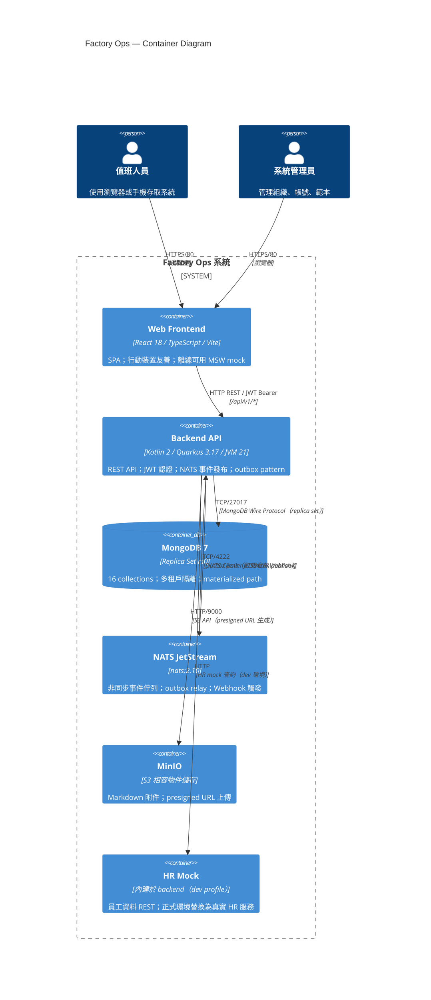
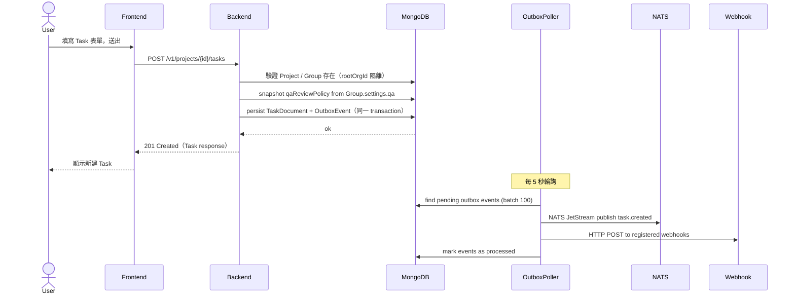
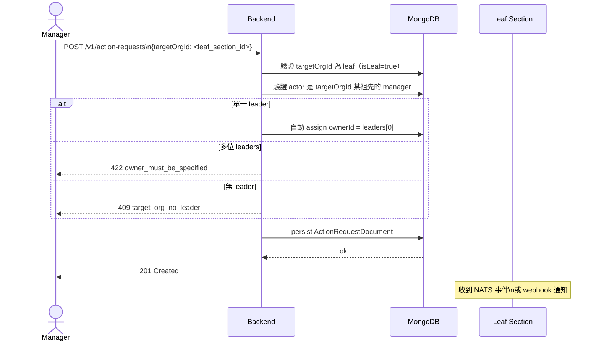
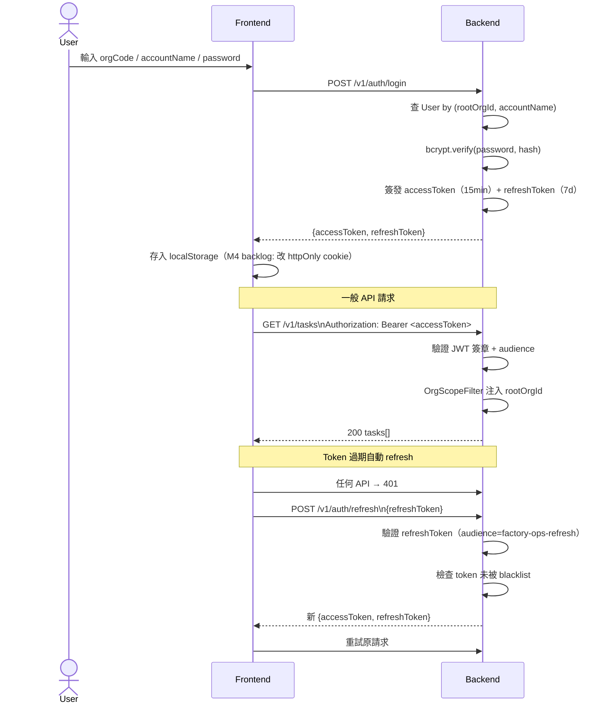
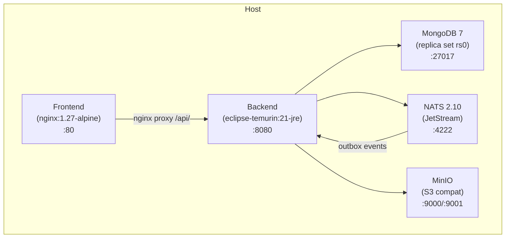
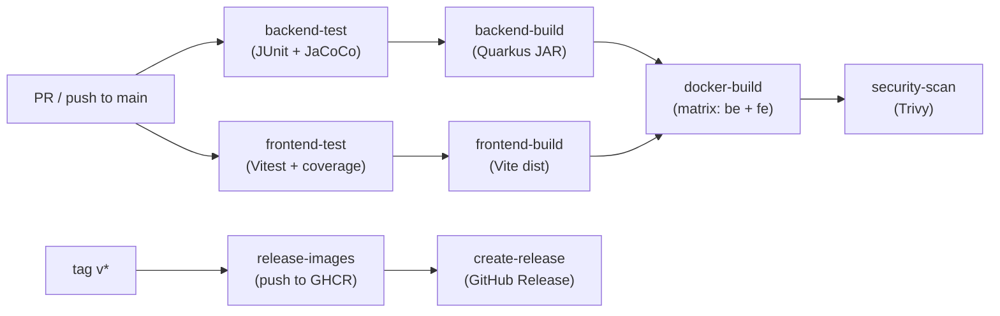

# 系統架構文件

**版本**: 1.0.0
**最後更新**: 2026-05-04
**對應規格**: spec v1.3.0 / data-model v1.0.0

---

## 1. 系統架構總覽（C4 Container 層）



---

## 2. 主要模組職責

### 後端模組（Kotlin / Quarkus）

```
backend/src/main/kotlin/com/factoryops/
├── domain/           純領域類別（無框架依賴）
│   ├── organization/ Organization 樹、OrgSettings
│   ├── task/         Task 多型、TaskStatus 狀態機、QA review
│   ├── actionrequest/ ActionRequest 單跳派工
│   └── shared/       共用 enum（Priority, Role, …）
├── persistence/      資料存取層
│   ├── document/     MongoDB Document（BSON 映射）
│   ├── repository/   Panache Repository（含 rootOrgId 隔離）
│   └── mapper/       Document ↔ Domain 轉換
├── application/      業務邏輯層
│   ├── service/      13 個 Service（Task、Org、Group、Dispatch 等）
│   ├── auth/         JWT 簽發、驗證、refresh、黑名單
│   ├── policy/       RBAC 評估器（RbacEvaluator）
│   └── seed/         DevDataSeeder（dev profile 專用）
├── interfaces/       入站介面
│   ├── rest/         13 個 JAX-RS Resource
│   ├── dto/          Request/Response DTO + 驗證注解
│   ├── filter/       OrgScopeFilter（多租戶 scope 注入）
│   └── exception/    GlobalExceptionMapper（RFC 7807）
└── infrastructure/   出站整合
    ├── nats/         NATS JetStream 發布
    ├── outbox/       OutboxPoller（排程輪詢 + 重試）
    ├── webhook/      Webhook 分發
    ├── storage/      MinIO 操作
    └── hr/           HR Mock / Real 客戶端
```

### 前端模組（React / TypeScript / Vite）

```
frontend/src/
├── routes/           13 頁面元件（React Router v6）
├── components/       17 共用 UI 元件
├── api/              11 個 API client（axios + TanStack Query）
├── hooks/            自訂 React hooks
├── store/            Zustand 全域狀態（auth 等）
├── auth/             認證流程（login / logout / refresh）
├── rbac/             前端 RBAC guard
├── i18n/             多語系（zh-TW / en-US）
├── mocks/            MSW service worker（離線 mock）
└── theme/            Mantine 主題設定
```

---

## 3. 資料流（關鍵 Use Case）

### 3.1 建立 Task 並觸發通知



### 3.2 跨層派工（ActionRequest Single-hop）



### 3.3 JWT 認證流程



---

## 4. 部署架構

### 4.1 Docker Compose（本機 / 單機部署）



服務啟動順序（`depends_on` + healthcheck）：
1. `mongo` → health check
2. `mongo-rs-init` → 初始化 replica set
3. `mongo-idx-init` → 建立索引
4. `nats` → health check
5. `minio` → health check
6. `minio-init` → 建立 bucket
7. `backend` → 依賴以上全部就緒
8. `frontend` → 依賴 backend healthy

### 4.2 CI/CD Pipeline



---

## 5. 多租戶隔離設計（ADR-0005）

所有 MongoDB collection（除 `organizations` 自身）第一個索引欄位為 `rootOrgId`。

Backend 在 `OrgScopeFilter` 從 JWT claims 取出 `rootOrgId` 後，注入所有 service 的查詢條件。任何缺少 `rootOrgId` 的查詢**不允許**（CI unit test 覆蓋）。

---

## 6. 事件架構（ADR-0009）

採用 **Transactional Outbox Pattern**：

1. Service 在同一個 MongoDB transaction 內同時 persist 業務文件與 `outbox_events` 文件
2. `OutboxPoller`（Quarkus Scheduler，每 5 秒）讀取未發送的 events（批次 100 筆）
3. 依 `targetChannel` 發送到 NATS JetStream 或直接 HTTP POST Webhook
4. 失敗計數 ≤ 5 次重試，超過後移入 dead-letter 欄位（P1 backlog）

---

## 7. 重要設計決策索引

| ADR | 主題 |
|---|---|
| [ADR-0001](adr/0001-polymorphic-task-design.md) | Task 多型設計 |
| [ADR-0002](adr/0002-multi-assignee-with-single-owner.md) | 多指派人 + 單一 owner |
| [ADR-0003](adr/0003-attachment-and-markdown-storage.md) | 附件 + Markdown 儲存（MinIO） |
| [ADR-0004](adr/0004-polymorphic-group-with-type.md) | Organization 樹 + 平面 Group |
| [ADR-0005](adr/0005-organization-multi-tenancy.md) | rootOrgId 多租戶隔離 |
| [ADR-0006](adr/0006-template-versioning-and-instantiation.md) | Template 版本化 + 實例化 |
| [ADR-0007](adr/0007-user-hr-integration.md) | HR 整合（mock / real） |
| [ADR-0008](adr/0008-action-request-cross-org-dispatch.md) | Single-hop 跨層派工 |
| [ADR-0009](adr/0009-event-distribution-nats-and-webhooks.md) | NATS + Webhook 事件分發 |
| [ADR-0010](adr/0010-org-manager-and-leaders.md) | 單 manager + 多 leaders |
| [ADR-0011](adr/0011-group-settings-qa-dualsign.md) | QA 雙簽 + snapshot at task creation |
| [ADR-0012](adr/0012-organization-tree-materialized-path.md) | Org 樹 materialized path |
| [ADR-0013](adr/0013-collection-naming-and-id-strategy.md) | Collection 命名 + ID 策略 |
