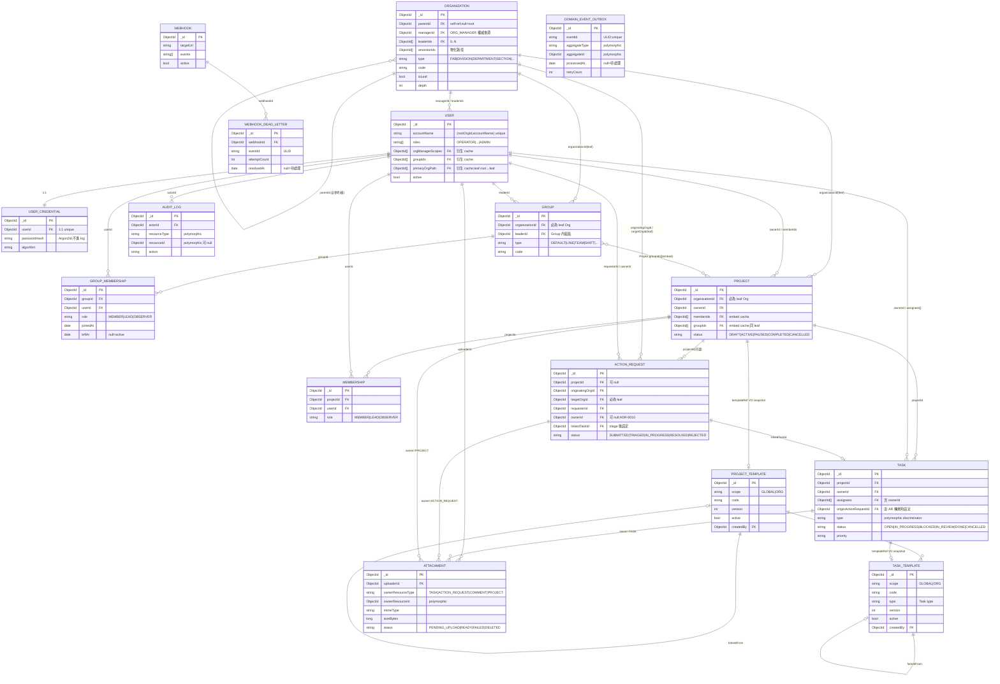

# 資料模型設計文件

**版本**: 1.0.0
**對應 Spec**: v1.3.0
**負責 agent**: mongodb-modeler
**最後更新**: 2026-05-04

---

## 0. 共用慣例

本節定義所有 collection 的共用決策,後面各節不再重複說明。

### 0.1 Collection 命名

一律採 **snake_case**,見 ADR-0013。

| Collection | 說明 |
|---|---|
| `organizations` | Organization 樹節點 |
| `users` | User(HR 投影) |
| `user_credentials` | 密碼 hash 獨立 collection |
| `groups` | Group(平面) |
| `group_memberships` | Group × User N:M + 歷程 |
| `memberships` | Project × User N:M |
| `projects` | Project |
| `tasks` | Task(polymorphic) |
| `action_requests` | ActionRequest |
| `project_templates` | ProjectTemplate(GLOBAL + ORG 同 collection) |
| `task_templates` | TaskTemplate(GLOBAL + ORG 同 collection) |
| `attachments` | Attachment metadata |
| `webhooks` | Webhook 訂閱 |
| `webhook_dead_letters` | Webhook 送達失敗死信 |
| `domain_event_outbox` | Outbox 模式 domain events |
| `audit_logs` | 系統級稽核日誌 |

### 0.2 ID 策略

- 所有 `_id` 欄位儲存 MongoDB **ObjectId**(BSON);domain layer 以 `String` 表示(hex 格式)。
- 對外 API 一律字串 ID,persistence mapper 負責轉換。
- 跨系統整合若需 UUID 可在 document 加 `externalId` 欄位,但 `_id` 仍用 ObjectId。

### 0.3 共用必備欄位(每個 aggregate root collection)

| 欄位 | 型別 | 說明 |
|---|---|---|
| `_id` | ObjectId | 主鍵(自動) |
| `rootOrgId` | ObjectId | 租戶鍵(organizations 自身例外) |
| `schemaVersion` | int | 初版為 1,遷移時遞增 |
| `createdAt` | Date(UTC) | 建立時間 |
| `updatedAt` | Date(UTC) | 最後更新時間 |
| `deletedAt` | Date? | 軟刪除時間;null 表示未刪 |

### 0.4 軟刪除慣例

- `deletedAt: null` 表示存活;軟刪除設為 `ISODate()`。
- Repository 層所有查詢預設加 `{ deletedAt: null }` 過濾(禁止「裸 query」)。
- 稽核需要保留歷史時不做 hard delete。
- 部分索引 `{ deletedAt: 1 }` 搭配 `partialFilterExpression: { deletedAt: { $ne: null } }` 加速軟刪除資源的清理查詢。

### 0.5 時間欄位

- **儲存層**:UTC `Instant`(MongoDB BSON Date,毫秒精度)。
- **API / 事件 wire format**:ISO 8601 + offset(`OffsetDateTime`,例 `2026-05-04T08:30:00+08:00`)。
- 轉換點在 application service / DTO 層;domain layer 內部統一 `Instant`。

### 0.6 history[] append-only 嵌入策略

所有 aggregate root 均內嵌 `history: []`:
- 每次寫入操作(狀態變更、指派、設定修改等)均 append 一筆 `HistoryEntry`。
- **上限警告**:超過 1000 筆時,應將舊 entries 冷儲歸檔至另一個 `history_archive` collection 或 object storage,再從主文件截斷為最近 200 筆。
- 歸檔策略由 backend-builder 實作;schema 層僅設計結構,不強制執行。

### 0.7 多租戶隔離

- 所有 query 必須帶 `rootOrgId`(從 JWT claims 取得),由 `RootOrgScopedRepository` 強制。
- 索引第一欄位均為 `rootOrgId`,以利日後 sharding by `rootOrgId`。
- `organizations` collection 本身是租戶邊界,其 `_id` 即為 `rootOrgId`。

### 0.8 Entity Relationship 圖

下圖為主要 collection 的核心參照關係。為了可讀性:

- 省略每個 collection 上的 `rootOrgId`(共用慣例,見 0.7;`organizations` 例外)。
- 省略 `createdAt` / `updatedAt` / `deletedAt` / `schemaVersion`(共用慣例,見 0.3-0.5)。
- 只列關鍵欄位(PK、FK、discriminator、status);完整 schema 見各節欄位表。



#### 圖中未繪出的特殊關係

| 類型 | 關係 | 處理方式 |
|---|---|---|
| 多租戶根 | 每個 collection 的 `rootOrgId` → root `ORGANIZATION._id` | 共用慣例,圖中省略以保持可讀性 |
| VO snapshot | `Project.templateRef` / `Task.templateRef` / `Task.qaReviewPolicy.sourceGroupIds` | 不可變快照,圖中以 `||--o|` 標註,實作上是 embed 的 ID 而非 live FK |
| Embed 衍生 cache | `User.orgManagerScopes` / `User.groupIds` / `User.primaryOrgPath` / `Project.memberIds` / `Project.groupIds` | 為查詢效能 embed 的 ObjectId 陣列;權威來源在另一 collection |
| Polymorphic ownership | `Attachment.ownerResourceType + ownerResourceId` | 圖中對主要 owner(TASK / ACTION_REQUEST / PROJECT)各畫一條;`COMMENT` 為 Task embed sub-document,不另畫 |
| Polymorphic event source | `DomainEventOutbox.aggregateType + aggregateId` | 不畫(任意 aggregate);追蹤靠 `aggregateType` discriminator |
| Polymorphic audit target | `AuditLog.resourceType + resourceId` | 不畫(任意 resource);追蹤靠 `resourceType` discriminator |
| 跨 organization 約束 | `Project.organizationId` 與 `Project.groupIds[]` 必同一 leaf(INV-19) | 圖無法表達;由應用層強制 |

---

## 1. organizations

### 設計理由

Organization 是整個系統的多型樹狀結構(FAB → DIVISION → DEPARTMENT → SECTION),同時作為多租戶邊界。每個節點採 **adjacency list + 物化 ancestorIds[]** 的混合策略(詳見 ADR-0012):

- `parentId`:adjacency list,表達直接親子關係
- `ancestorIds[]`:物化路徑 array,允許 `{ ancestorIds: targetId }` IN 查詢取子孫,免 `$graphLookup`
- `isLeaf`:衍生 boolean,寫入時由 `type ∈ root.settings.leafTypes` 計算並存
- `depth`:衍生 int,從 root 距離(root = 0)

`managerId`(單值)與 `leaderIds[]`(0..N)為 v1.3 新欄位(ADR-0010)。`settings` 僅 root 節點有效,其他節點為 null。

**embed vs reference**:
- `settings`(OrgSettings VO)Embed:僅 root 有,且每次讀 root 都需要它。
- `history[]` Embed:append-only;每次讀 org 詳情都需要近期記錄。
- `leaderIds[]` Embed:短陣列(預估 ≤ 5)。
- `managerId` Embed:單值 FK。
- Group / Project / User 均 Reference(獨立生命週期、獨立查詢)。

### Document 範例

```json
{
  "_id": ObjectId("507f1f77bcf86cd799439011"),
  "rootOrgId": ObjectId("507f1f77bcf86cd799439011"),
  "parentId": null,
  "type": "FAB",
  "name": "台中廠",
  "code": "tch-fab",
  "managerId": ObjectId("507f1f77bcf86cd799439020"),
  "leaderIds": [
    ObjectId("507f1f77bcf86cd799439021"),
    ObjectId("507f1f77bcf86cd799439022")
  ],
  "ancestorIds": [],
  "isLeaf": false,
  "depth": 0,
  "timezone": "Asia/Taipei",
  "locale": "zh-TW",
  "settings": {
    "orgMaxDepth": 5,
    "leafTypes": ["SECTION"],
    "attachmentMaxBytes": 52428800,
    "extras": {}
  },
  "history": [
    {
      "actorId": ObjectId("507f1f77bcf86cd799439020"),
      "action": "ORG_CREATED",
      "at": ISODate("2026-01-01T00:00:00Z"),
      "payload": {}
    }
  ],
  "schemaVersion": 1,
  "createdAt": ISODate("2026-01-01T00:00:00Z"),
  "updatedAt": ISODate("2026-01-01T00:00:00Z"),
  "deletedAt": null
}
```

葉節點(SECTION)範例:

```json
{
  "_id": ObjectId("507f1f77bcf86cd799439031"),
  "rootOrgId": ObjectId("507f1f77bcf86cd799439011"),
  "parentId": ObjectId("507f1f77bcf86cd799439028"),
  "type": "SECTION",
  "name": "裝配課",
  "code": "assembly-section",
  "managerId": null,
  "leaderIds": [ObjectId("507f1f77bcf86cd799439040")],
  "ancestorIds": [
    ObjectId("507f1f77bcf86cd799439011"),
    ObjectId("507f1f77bcf86cd799439025"),
    ObjectId("507f1f77bcf86cd799439028")
  ],
  "isLeaf": true,
  "depth": 3,
  "timezone": null,
  "locale": null,
  "settings": null,
  "history": [],
  "schemaVersion": 1,
  "createdAt": ISODate("2026-01-02T00:00:00Z"),
  "updatedAt": ISODate("2026-01-02T00:00:00Z"),
  "deletedAt": null
}
```

### 欄位表

| 欄位 | BSON 型別 | Required | 範例值 | 備註 |
|---|---|---|---|---|
| `_id` | ObjectId | Y | `507f...` | 自動產生 |
| `rootOrgId` | ObjectId | Y | `507f...` | root 節點時 = `_id` |
| `parentId` | ObjectId? | N | `507f...` | null = root |
| `type` | String | Y | `SECTION` | FAB/DIVISION/DEPARTMENT/SECTION/自訂 |
| `name` | String | Y | `裝配課` | Unicode,1-120 chars |
| `code` | String | Y | `assembly-section` | `(rootOrgId)` unique |
| `managerId` | ObjectId? | N | `507f...` | v1.3;ORG_MANAGER 角色的權威來源 |
| `leaderIds` | ObjectId[] | Y | `[...]` | v1.3;預設 `[]` |
| `ancestorIds` | ObjectId[] | Y | `[...]` | 物化路徑;root = `[]`;寫入時維護 |
| `isLeaf` | Boolean | Y | `true` | 衍生;`type ∈ root.settings.leafTypes` |
| `depth` | Int | Y | `3` | 衍生;root = 0 |
| `timezone` | String? | N | `Asia/Taipei` | 僅 root 有效;IANA tz |
| `locale` | String? | N | `zh-TW` | 僅 root 有效;BCP-47 |
| `settings` | Object? | N | `{...}` | 僅 root 有效 |
| `settings.orgMaxDepth` | Int | N | `5` | |
| `settings.leafTypes` | String[] | N | `["SECTION"]` | |
| `settings.attachmentMaxBytes` | Long | N | `52428800` | |
| `settings.extras` | Object | N | `{}` | 自由擴充 |
| `history` | Array | Y | `[...]` | append-only HistoryEntry |
| `schemaVersion` | Int | Y | `1` | |
| `createdAt` | Date | Y | `ISODate(...)` | UTC |
| `updatedAt` | Date | Y | `ISODate(...)` | UTC |
| `deletedAt` | Date? | Y | `null` | 軟刪除 |

### 寫入模式

- 建立:一次寫入整個 document。
- move(parentId 變更):事務內更新自身及所有子孫的 `ancestorIds[]`、`depth`、`isLeaf`。
- transfer-manager:更新 `managerId`、append `history`、emit `org.manager-transferred`。
- add/remove leader:更新 `leaderIds[]`、append `history`。

### 讀取模式

- 列出樹:按 `rootOrgId` + 可選 `parentId`、`type`、`isLeaf`。
- 取子孫:`{ ancestorIds: nodeId }` IN query。
- 反查 manager nodes:`{ managerId: userId }`。
- 反查 leader nodes:`{ leaderIds: userId }`(multikey)。

---

## 2. users

### 設計理由

User 是 HR 系統的本地投影,profile 欄位(`displayName`、`email`、`employeeNo`)以 HR 為權威。`roles[]` 由本系統管理。`orgManagerScopes[]` 為衍生 cache(詳見 ADR-0010)。

**密碼獨立 collection**(`user_credentials`):密碼 hash 與 User profile 分離。好處:GDPR 合規(離職清除密碼而保留業務記錄)、密碼 hash 不進業務 log、可獨立 rotate。

**embed vs reference**:
- `roles[]` Embed:短陣列,與 User 一起讀。
- `orgManagerScopes[]` Embed(衍生 cache):短陣列,用於 JWT claims 快取加速 RBAC。
- `groupIds[]` Embed(衍生 cache):由 GroupMembership 反查維護,方便 JWT claims。
- `primaryOrgPath[]` Embed(衍生 cache):短陣列。
- GroupMembership Reference(獨立 collection):需獨立查詢/分頁/歷程。

### Document 範例

```json
{
  "_id": ObjectId("507f1f77bcf86cd799439040"),
  "rootOrgId": ObjectId("507f1f77bcf86cd799439011"),
  "accountName": "alice.wang",
  "employeeNo": "EMP-00123",
  "email": "alice.wang@factory.example.com",
  "displayName": "王小明",
  "roles": ["OPERATOR", "SHIFT_LEAD"],
  "orgManagerScopes": [],
  "groupIds": [
    ObjectId("507f1f77bcf86cd799439050")
  ],
  "primaryOrgPath": [
    ObjectId("507f1f77bcf86cd799439011"),
    ObjectId("507f1f77bcf86cd799439025"),
    ObjectId("507f1f77bcf86cd799439028"),
    ObjectId("507f1f77bcf86cd799439031")
  ],
  "hrSyncedAt": ISODate("2026-05-01T02:00:00Z"),
  "active": true,
  "schemaVersion": 1,
  "createdAt": ISODate("2026-01-10T00:00:00Z"),
  "deletedAt": null
}
```

### 欄位表

| 欄位 | BSON 型別 | Required | 範例值 | 備註 |
|---|---|---|---|---|
| `_id` | ObjectId | Y | | |
| `rootOrgId` | ObjectId | Y | | |
| `accountName` | String | Y | `alice.wang` | `(rootOrgId, accountName)` unique;最長 30 |
| `employeeNo` | String | Y | `EMP-00123` | HR snapshot |
| `email` | String? | N | `...@...` | HR snapshot;可 null |
| `displayName` | String | Y | `王小明` | HR snapshot;Unicode |
| `roles` | String[] | Y | `["OPERATOR"]` | 系統管理;不含 ORG_MANAGER(衍生) |
| `orgManagerScopes` | ObjectId[] | Y | `[]` | 衍生 cache;reactor 維護 |
| `groupIds` | ObjectId[] | Y | `[...]` | 衍生 cache;active GroupMembership 反查 |
| `primaryOrgPath` | ObjectId[] | Y | `[...]` | 衍生 cache;所屬 leaf 的 root→leaf path |
| `hrSyncedAt` | Date? | N | `ISODate(...)` | 最近 HR 同步時間 |
| `active` | Boolean | Y | `true` | HR 離職時 false |
| `schemaVersion` | Int | Y | `1` | |
| `createdAt` | Date | Y | | UTC |
| `deletedAt` | Date? | Y | `null` | |

注意:`updatedAt` 不在 User 中,因 User 的主要欄位(profile)以 HR 為準,且 `hrSyncedAt` 已記錄同步時間。若需要,可加回 `updatedAt`。

### user_credentials Collection

密碼獨立儲存,與 User document 分離。

```json
{
  "_id": ObjectId("..."),
  "userId": ObjectId("507f1f77bcf86cd799439040"),
  "rootOrgId": ObjectId("507f1f77bcf86cd799439011"),
  "passwordHash": "$argon2id$v=19$m=65536,t=3,p=4$...",
  "algorithm": "ARGON2ID",
  "updatedAt": ISODate("2026-01-10T00:00:00Z"),
  "schemaVersion": 1
}
```

| 欄位 | BSON 型別 | Required | 備註 |
|---|---|---|---|
| `_id` | ObjectId | Y | |
| `userId` | ObjectId | Y | unique;1:1 對應 User |
| `rootOrgId` | ObjectId | Y | 租戶鍵 |
| `passwordHash` | String | Y | 不進任何 log |
| `algorithm` | String | Y | ARGON2ID |
| `updatedAt` | Date | Y | UTC |
| `schemaVersion` | Int | Y | `1` |

---

## 3. groups

### 設計理由

Group 為平面結構(無 parentId),屬唯一 leaf Organization。`settings.qa` 子文件為 v1.3 新增(ADR-0011),於 Task 建立時 snapshot 至 `task.qaReviewPolicy`。

**embed vs reference**:
- `settings`(GroupSettings VO)Embed:小型 VO,與 Group 一起讀。
- `history[]` Embed:append-only。
- `attributes` Embed:type-specific 自由欄位,小型 object。
- GroupMembership Reference(獨立 collection):N:M + 歷程。

### Document 範例

```json
{
  "_id": ObjectId("507f1f77bcf86cd799439050"),
  "rootOrgId": ObjectId("507f1f77bcf86cd799439011"),
  "organizationId": ObjectId("507f1f77bcf86cd799439031"),
  "type": "SHIFT",
  "name": "裝配課夜班",
  "code": "assembly-night-shift",
  "leaderId": ObjectId("507f1f77bcf86cd799439040"),
  "attributes": {
    "shiftCode": "NIGHT",
    "startLocalTime": "22:00",
    "endLocalTime": "06:00"
  },
  "settings": {
    "qa": {
      "dualSignRequired": true,
      "requiredReviewerRoles": ["QA", "SHIFT_LEAD"]
    },
    "extras": {}
  },
  "history": [
    {
      "actorId": ObjectId("507f1f77bcf86cd799439060"),
      "action": "GROUP_SETTINGS_QA_UPDATED",
      "at": ISODate("2026-03-01T00:00:00Z"),
      "payload": {
        "before": { "dualSignRequired": false, "requiredReviewerRoles": [] },
        "after": { "dualSignRequired": true, "requiredReviewerRoles": ["QA", "SHIFT_LEAD"] }
      }
    }
  ],
  "schemaVersion": 1,
  "createdAt": ISODate("2026-01-05T00:00:00Z"),
  "updatedAt": ISODate("2026-03-01T00:00:00Z"),
  "deletedAt": null
}
```

### 欄位表

| 欄位 | BSON 型別 | Required | 範例值 | 備註 |
|---|---|---|---|---|
| `_id` | ObjectId | Y | | |
| `rootOrgId` | ObjectId | Y | | 租戶鍵 |
| `organizationId` | ObjectId | Y | | 必為 leaf Org |
| `type` | String | Y | `SHIFT` | DEFAULT/LINE/TEAM/SHIFT/自訂 |
| `name` | String | Y | `裝配課夜班` | Unicode,1-120 |
| `code` | String | Y | `assembly-night-shift` | `(rootOrgId)` unique |
| `leaderId` | ObjectId? | N | `507f...` | Group 內組長;與 Org.leaderIds 不同概念 |
| `attributes` | Object | Y | `{...}` | type-specific,寬鬆 schema |
| `settings` | Object | Y | `{...}` | 必填,預設 `{ qa: { dualSignRequired: false, requiredReviewerRoles: [] }, extras: {} }` |
| `settings.qa.dualSignRequired` | Boolean | Y | `true` | |
| `settings.qa.requiredReviewerRoles` | String[] | Y | `["QA","SHIFT_LEAD"]` | 僅第一線角色 |
| `settings.extras` | Object | Y | `{}` | |
| `history` | Array | Y | `[...]` | append-only |
| `schemaVersion` | Int | Y | `1` | |
| `createdAt` | Date | Y | | |
| `updatedAt` | Date | Y | | |
| `deletedAt` | Date? | Y | `null` | |

---

## 4. group_memberships

### 設計理由

**為何獨立 collection**:
1. **N:M 關係**:User 可屬多個 Group;Group 有多個 User。
2. **保留歷程**:`leftAt` 記錄離開時間,支援「user 曾屬哪些 Group」查詢。
3. **雙向高頻查詢**:「group 有哪些 active 成員」與「user 屬於哪些 group」都需要獨立索引。
4. **獨立分頁**:成員列表需要 cursor-based 分頁,不適合 embed 在 Group 或 User。

### Document 範例

```json
{
  "_id": ObjectId("507f1f77bcf86cd799439070"),
  "rootOrgId": ObjectId("507f1f77bcf86cd799439011"),
  "groupId": ObjectId("507f1f77bcf86cd799439050"),
  "userId": ObjectId("507f1f77bcf86cd799439040"),
  "role": "MEMBER",
  "joinedAt": ISODate("2026-01-15T00:00:00Z"),
  "leftAt": null,
  "createdBy": ObjectId("507f1f77bcf86cd799439060"),
  "schemaVersion": 1
}
```

### 欄位表

| 欄位 | BSON 型別 | Required | 範例值 | 備註 |
|---|---|---|---|---|
| `_id` | ObjectId | Y | | |
| `rootOrgId` | ObjectId | Y | | 租戶鍵 |
| `groupId` | ObjectId | Y | | ref to groups |
| `userId` | ObjectId | Y | | ref to users |
| `role` | String | Y | `MEMBER` | MEMBER/LEAD/OBSERVER |
| `joinedAt` | Date | Y | | UTC |
| `leftAt` | Date? | N | `null` | 離開時設定;null = active |
| `createdBy` | ObjectId | Y | | 操作者 |
| `schemaVersion` | Int | Y | `1` | |

注意:GroupMembership 無 `deletedAt`(用 `leftAt` 語意相同)。無 `updatedAt`(記錄不可變,離開時新增 `leftAt`)。

---

## 5. memberships(ProjectMembership)

### 設計理由

Project × User N:M 關係。獨立 collection 原因同 group_memberships:N:M + 獨立查詢需求。

### Document 範例

```json
{
  "_id": ObjectId("507f1f77bcf86cd799439080"),
  "rootOrgId": ObjectId("507f1f77bcf86cd799439011"),
  "projectId": ObjectId("507f1f77bcf86cd799439090"),
  "userId": ObjectId("507f1f77bcf86cd799439040"),
  "role": "MEMBER",
  "joinedAt": ISODate("2026-02-01T00:00:00Z"),
  "schemaVersion": 1
}
```

### 欄位表

| 欄位 | BSON 型別 | Required | 範例值 | 備註 |
|---|---|---|---|---|
| `_id` | ObjectId | Y | | |
| `rootOrgId` | ObjectId | Y | | 租戶鍵 |
| `projectId` | ObjectId | Y | | ref to projects |
| `userId` | ObjectId | Y | | ref to users |
| `role` | String | Y | `MEMBER` | MEMBER/LEAD/OBSERVER |
| `joinedAt` | Date | Y | | UTC |
| `schemaVersion` | Int | Y | `1` | |

---

## 6. projects

### 設計理由

Project 屬唯一 leaf Organization,包含 `groupIds[]`(所有 group 必須屬於同一 leaf Org,INV-19)。

**embed vs reference**:
- `history[]` Embed:append-only,讀取 Project 詳情時一起回傳。
- `memberIds[]` Embed:僅存 ObjectId 陣列,快速過濾「我的 project」。
- `groupIds[]` Embed:僅存 ObjectId 陣列,快速過濾。
- `templateRef`(VO snapshot)Embed:不可變快照。
- `tags[]` Embed:字串陣列。
- Task、ActionRequest Reference:各自獨立 collection,透過 `projectId` 反查。

**comments 決策**:Project 本身無 comments。

### Document 範例

```json
{
  "_id": ObjectId("507f1f77bcf86cd799439090"),
  "rootOrgId": ObjectId("507f1f77bcf86cd799439011"),
  "organizationId": ObjectId("507f1f77bcf86cd799439031"),
  "name": "2026 Q2 設備維護專案",
  "descriptionMarkdown": "# 目標\n本季度完成所有 A 級設備年保。",
  "status": "ACTIVE",
  "ownerId": ObjectId("507f1f77bcf86cd799439040"),
  "memberIds": [
    ObjectId("507f1f77bcf86cd799439040"),
    ObjectId("507f1f77bcf86cd799439041")
  ],
  "groupIds": [
    ObjectId("507f1f77bcf86cd799439050"),
    ObjectId("507f1f77bcf86cd799439051")
  ],
  "schedule": {
    "start": ISODate("2026-04-01T00:00:00Z"),
    "due": ISODate("2026-06-30T23:59:59Z")
  },
  "tags": ["maintenance", "q2"],
  "templateRef": {
    "templateType": "PROJECT_TEMPLATE",
    "templateScope": "ORG",
    "templateId": "507f1f77bcf86cd799439100",
    "templateVersion": 3,
    "instantiatedAt": ISODate("2026-04-01T00:00:00Z")
  },
  "history": [],
  "schemaVersion": 1,
  "createdAt": ISODate("2026-04-01T00:00:00Z"),
  "updatedAt": ISODate("2026-04-01T00:00:00Z"),
  "deletedAt": null
}
```

### 欄位表

| 欄位 | BSON 型別 | Required | 範例值 | 備註 |
|---|---|---|---|---|
| `_id` | ObjectId | Y | | |
| `rootOrgId` | ObjectId | Y | | |
| `organizationId` | ObjectId | Y | | 必為 leaf Org |
| `name` | String | Y | `2026 Q2...` | 1-120 |
| `descriptionMarkdown` | String | N | `# 目標...` | Markdown 格式 |
| `status` | String | Y | `ACTIVE` | DRAFT/ACTIVE/PAUSED/COMPLETED/CANCELLED |
| `ownerId` | ObjectId | Y | | `∈ memberIds` |
| `memberIds` | ObjectId[] | Y | `[...]` | 含 ownerId |
| `groupIds` | ObjectId[] | Y | `[...]` | 至少 1;同 leaf Org |
| `schedule` | Object? | N | `{start, due}` | UTC Instant |
| `tags` | String[] | Y | `[...]` | 每個 ≤ 32 chars |
| `templateRef` | Object? | N | `{...}` | VO snapshot |
| `history` | Array | Y | `[...]` | append-only |
| `schemaVersion` | Int | Y | `1` | |
| `createdAt` | Date | Y | | |
| `updatedAt` | Date | Y | | |
| `deletedAt` | Date? | Y | `null` | |

---

## 7. tasks

### 設計理由

Task 是系統核心 aggregate,採 **single-collection polymorphic**(ADR-0001):所有 type(EQUIPMENT_INSPECTION、INCIDENT_RESPONSE、SHIFT_HANDOVER…)存同一 collection,`type` 欄位作 discriminator,`attributes` 自由 JSON sub-document。

**v1.3 新增**:`qaReviewPolicy`(VO snapshot)與 `qaReviews[]`(append-only)。

**embed vs reference 關鍵決策**:

| 子資料 | 選擇 | 理由 |
|---|---|---|
| `comments[]` | **Embed**(預設) | 工廠場景預估 ≤ 50 / Task;一起讀;生命週期依附 Task |
| `history[]` | **Embed** | append-only;生命週期依附 Task;>1000 筆歸檔 |
| `qaReviewPolicy` | **Embed** | VO snapshot,不可變;小型 object |
| `qaReviews[]` | **Embed** | 預估 ≤ 5 / Task;append-only;一起讀 |
| `attachments[]` | **Reference**(attachments collection);Task 僅存 `AttachmentRef[]` | 附件有獨立生命週期、獨立下載 URL、可被多個資源共用 |
| `assignees[]` | **Embed**(僅 ID)| 短陣列 ObjectId;需要 multikey 索引過濾 |

**comments[] embed 決策與門檻**:
- 預設 embed,因工廠值班場景每個 Task 留言量預估 ≤ 50 筆。
- 軟性警告門檻:單一 Task 的 `comments[]` 超過 100 筆時,系統應告警並考慮拆分為獨立 `task_comments` collection。
- 若任一租戶出現 Task > 100 留言的情況,遷移計畫:建立 `task_comments` collection + 將現有 embed 資料 migrate,Task 保留最新 10 筆快取方便 UI 預覽。
- 見 ADR-0014(若拆分時使用)或保留此說明。

### Document 範例

```json
{
  "_id": ObjectId("507f1f77bcf86cd799439200"),
  "rootOrgId": ObjectId("507f1f77bcf86cd799439011"),
  "projectId": ObjectId("507f1f77bcf86cd799439090"),
  "type": "EQUIPMENT_INSPECTION",
  "title": "CNC-M3 每週點檢",
  "descriptionMarkdown": "## 點檢項目\n1. 油壓系統\n2. 主軸",
  "status": "IN_REVIEW",
  "priority": "HIGH",
  "ownerId": ObjectId("507f1f77bcf86cd799439040"),
  "assignees": [
    ObjectId("507f1f77bcf86cd799439040"),
    ObjectId("507f1f77bcf86cd799439041")
  ],
  "attributes": {
    "equipmentId": "CNC-M3",
    "checklist": [
      { "id": "chk-001", "label": "油壓系統", "required": true, "checked": true },
      { "id": "chk-002", "label": "主軸冷卻", "required": true, "checked": false }
    ]
  },
  "attachments": [
    {
      "attachmentId": "507f1f77bcf86cd799439210",
      "alt": "點檢前照片",
      "role": "INLINE"
    }
  ],
  "schedule": {
    "start": ISODate("2026-05-01T06:00:00Z"),
    "due": ISODate("2026-05-01T14:00:00Z")
  },
  "completedAt": null,
  "originActionRequestId": null,
  "templateRef": {
    "templateType": "TASK_TEMPLATE",
    "templateScope": "ORG",
    "templateId": "507f1f77bcf86cd799439110",
    "templateVersion": 2,
    "instantiatedAt": ISODate("2026-05-01T06:00:00Z")
  },
  "qaReviewPolicy": {
    "dualSignRequired": true,
    "requiredReviewerRoles": ["QA", "SHIFT_LEAD"],
    "snapshotAt": ISODate("2026-05-01T06:00:00Z"),
    "sourceGroupIds": [
      ObjectId("507f1f77bcf86cd799439050")
    ]
  },
  "qaReviews": [
    {
      "reviewerId": ObjectId("507f1f77bcf86cd799439060"),
      "reviewerRole": "QA",
      "decision": "APPROVED",
      "reason": null,
      "at": ISODate("2026-05-01T13:00:00Z")
    }
  ],
  "comments": [
    {
      "id": "507f1f77bcf86cd799439220",
      "authorId": ObjectId("507f1f77bcf86cd799439040"),
      "bodyMarkdown": "油壓系統壓力正常,主軸溫度稍高需注意。",
      "attachments": [],
      "createdAt": ISODate("2026-05-01T10:00:00Z"),
      "editedAt": null,
      "deletedAt": null
    }
  ],
  "tags": ["equipment", "weekly"],
  "history": [
    {
      "actorId": ObjectId("507f1f77bcf86cd799439040"),
      "action": "TASK_STATUS_CHANGED",
      "at": ISODate("2026-05-01T09:00:00Z"),
      "payload": { "from": "OPEN", "to": "IN_PROGRESS" }
    }
  ],
  "schemaVersion": 1,
  "createdAt": ISODate("2026-05-01T06:00:00Z"),
  "updatedAt": ISODate("2026-05-01T13:00:00Z"),
  "deletedAt": null
}
```

### 欄位表

| 欄位 | BSON 型別 | Required | 範例值 | 備註 |
|---|---|---|---|---|
| `_id` | ObjectId | Y | | |
| `rootOrgId` | ObjectId | Y | | |
| `projectId` | ObjectId | Y | | ref to projects |
| `type` | String | Y | `EQUIPMENT_INSPECTION` | polymorphic discriminator |
| `title` | String | Y | `CNC-M3 每週點檢` | 1-200;Unicode |
| `descriptionMarkdown` | String? | N | `## 點檢...` | Markdown;可含圖片 `attachment://{id}` 語法 |
| `status` | String | Y | `IN_REVIEW` | OPEN/IN_PROGRESS/BLOCKED/IN_REVIEW/DONE/CANCELLED |
| `priority` | String | Y | `HIGH` | LOW/NORMAL/HIGH/URGENT |
| `ownerId` | ObjectId | Y | | `∈ assignees` |
| `assignees` | ObjectId[] | Y | `[...]` | distinct;含 ownerId |
| `attributes` | Object | Y | `{...}` | type-specific;server JSON Schema 驗證 |
| `attachments` | Array | Y | `[...]` | AttachmentRef VO 陣列 |
| `schedule` | Object? | N | `{start, due}` | UTC |
| `completedAt` | Date? | N | `null` | DONE 時設定 |
| `originActionRequestId` | ObjectId? | N | `null` | 由 AR convert 而來時設定 |
| `templateRef` | Object? | N | `{...}` | VO snapshot |
| `qaReviewPolicy` | Object | Y | `{...}` | VO snapshot;Task 建立時計算;不可變 |
| `qaReviewPolicy.dualSignRequired` | Boolean | Y | `true` | |
| `qaReviewPolicy.requiredReviewerRoles` | String[] | Y | `["QA"]` | |
| `qaReviewPolicy.snapshotAt` | Date | Y | | UTC |
| `qaReviewPolicy.sourceGroupIds` | ObjectId[] | Y | `[...]` | 稽核用 |
| `qaReviews` | Array | Y | `[...]` | append-only;預估 ≤ 5 |
| `comments` | Array | Y | `[...]` | embed;預估 ≤ 50;> 100 考慮拆分 |
| `tags` | String[] | Y | `[...]` | 每個 ≤ 32 |
| `history` | Array | Y | `[...]` | append-only;> 1000 歸檔 |
| `schemaVersion` | Int | Y | `1` | |
| `createdAt` | Date | Y | | |
| `createdBy` | ObjectId | Y | | 建立者 userId |
| `updatedAt` | Date | Y | | |
| `deletedAt` | Date? | Y | `null` | |

---

## 8. action_requests

### 設計理由

ActionRequest(v1.3 改為 Single-hop Direct Dispatch,ADR-0008):
- `targetOrgId` 必為 leaf Organization。
- `originatingOrgId` 記錄 dispatch manager 所屬節點。
- 移除 `relayChain[]`。
- `linkedTaskId` 於 triage 後設定。

**embed vs reference**:
- `history[]` Embed:同 Task。
- `attachments[]` Embed(AttachmentRef VO 陣列):只需 ID + role,附件本體在 MinIO。
- `severity`(VO)Embed:小型 VO,與 AR 一起讀。
- Task Reference(透過 `linkedTaskId`):Task 獨立生命週期。

### Document 範例

```json
{
  "_id": ObjectId("507f1f77bcf86cd799439300"),
  "rootOrgId": ObjectId("507f1f77bcf86cd799439011"),
  "projectId": null,
  "originatingOrgId": ObjectId("507f1f77bcf86cd799439011"),
  "targetOrgId": ObjectId("507f1f77bcf86cd799439031"),
  "title": "新設機台安裝需支援",
  "descriptionMarkdown": "SMT-L5 新機台需裝配課協助安裝調試。",
  "severity": {
    "level": "HIGH",
    "reason": "影響產線排程"
  },
  "status": "SUBMITTED",
  "requesterId": ObjectId("507f1f77bcf86cd799439020"),
  "ownerId": ObjectId("507f1f77bcf86cd799439040"),
  "linkedTaskId": null,
  "attachments": [],
  "history": [
    {
      "actorId": ObjectId("507f1f77bcf86cd799439020"),
      "action": "ACTION_REQUEST_DISPATCHED",
      "at": ISODate("2026-05-03T08:00:00Z"),
      "payload": {
        "originatingOrgId": "507f1f77bcf86cd799439011",
        "targetOrgId": "507f1f77bcf86cd799439031"
      }
    }
  ],
  "submittedAt": ISODate("2026-05-03T08:00:00Z"),
  "resolvedAt": null,
  "schemaVersion": 1,
  "createdAt": ISODate("2026-05-03T08:00:00Z"),
  "updatedAt": ISODate("2026-05-03T08:00:00Z"),
  "deletedAt": null
}
```

### 欄位表

| 欄位 | BSON 型別 | Required | 備註 |
|---|---|---|---|
| `_id` | ObjectId | Y | |
| `rootOrgId` | ObjectId | Y | |
| `projectId` | ObjectId? | N | 自課內提報時必填 |
| `originatingOrgId` | ObjectId | Y | dispatch 發起節點 |
| `targetOrgId` | ObjectId | Y | 必為 leaf;v1.3 改名 |
| `title` | String | Y | 1-200;Unicode |
| `descriptionMarkdown` | String? | N | |
| `severity` | Object | Y | VO;level + reason |
| `status` | String | Y | SUBMITTED/TRIAGED/IN_PROGRESS/RESOLVED/REJECTED |
| `requesterId` | ObjectId | Y | |
| `ownerId` | ObjectId? | N | ADR-0010 規則計算 |
| `linkedTaskId` | ObjectId? | N | triage 後設定 |
| `attachments` | Array | Y | AttachmentRef VO[] |
| `history` | Array | Y | append-only |
| `submittedAt` | Date | Y | UTC |
| `resolvedAt` | Date? | N | UTC |
| `schemaVersion` | Int | Y | `1` |
| `createdAt` | Date | Y | |
| `updatedAt` | Date | Y | |
| `deletedAt` | Date? | Y | null |

---

## 9. project_templates

### 設計理由

GLOBAL 與 ORG scope 同一 collection,用 `scope` 欄位區分(ADR-0006):
- 可以單一查詢同時搜尋兩種 scope。
- partial unique index 處理 `(scope, rootOrgId, code, version)` 唯一性(GLOBAL 時 `rootOrgId` 為 null)。
- 版本管理:每次更新產生新 document(新 version),舊版本凍結。
- `active` 欄位標記是否為有效版本。

**embed vs reference**:
- `taskTemplateRefs[]` Embed:VO 陣列;小型;與 template 一起讀。
- `history[]` Embed:append-only。
- `forkedFrom`(VO)Embed:snapshot,不可變。
- `tags[]` Embed:字串陣列。

### Document 範例

```json
{
  "_id": ObjectId("507f1f77bcf86cd799439100"),
  "scope": "ORG",
  "rootOrgId": ObjectId("507f1f77bcf86cd799439011"),
  "name": "設備保養專案範本",
  "code": "equipment-maintenance",
  "descriptionMarkdown": "標準設備保養專案流程。",
  "defaultMemberRoles": { "ENGINEER": 1, "OPERATOR": 2 },
  "taskTemplateRefs": [
    {
      "taskTemplateScope": "GLOBAL",
      "taskTemplateId": "507f1f77bcf86cd799439120",
      "version": 1,
      "sortOrder": 1,
      "estimatedHours": 2.0
    }
  ],
  "estimatedDurationDays": 7,
  "tags": ["equipment", "maintenance"],
  "forkedFrom": null,
  "version": 3,
  "active": true,
  "createdBy": ObjectId("507f1f77bcf86cd799439060"),
  "history": [],
  "schemaVersion": 1,
  "createdAt": ISODate("2026-03-01T00:00:00Z"),
  "updatedAt": ISODate("2026-03-01T00:00:00Z"),
  "deletedAt": null
}
```

### 欄位表

| 欄位 | BSON 型別 | Required | 備註 |
|---|---|---|---|
| `_id` | ObjectId | Y | |
| `scope` | String | Y | GLOBAL/ORG |
| `rootOrgId` | ObjectId? | N | GLOBAL 時 null |
| `name` | String | Y | |
| `code` | String | Y | `(scope, rootOrgId)` unique per version |
| `descriptionMarkdown` | String? | N | |
| `defaultMemberRoles` | Object | Y | `{ role: count }` |
| `taskTemplateRefs` | Array | Y | TaskTemplateRef VO[] |
| `estimatedDurationDays` | Int? | N | |
| `tags` | String[] | Y | |
| `forkedFrom` | Object? | N | ForkRef VO |
| `version` | Int | Y | ≥ 1 |
| `active` | Boolean | Y | |
| `createdBy` | ObjectId | Y | |
| `history` | Array | Y | append-only |
| `schemaVersion` | Int | Y | `1` |
| `createdAt` | Date | Y | |
| `updatedAt` | Date | Y | |
| `deletedAt` | Date? | Y | null |

---

## 10. task_templates

與 `project_templates` 結構類似,以 `scope` 區分 GLOBAL/ORG。

### Document 範例

```json
{
  "_id": ObjectId("507f1f77bcf86cd799439120"),
  "scope": "GLOBAL",
  "rootOrgId": null,
  "name": "設備點檢 Task 範本",
  "code": "equipment-inspection-tpl",
  "type": "EQUIPMENT_INSPECTION",
  "defaultPriority": "NORMAL",
  "defaultAttributes": {
    "checklist": [
      { "id": "chk-001", "label": "外觀檢查", "required": true },
      { "id": "chk-002", "label": "油位確認", "required": true }
    ]
  },
  "descriptionMarkdownTemplate": "## 點檢報告\n**設備**: {{equipmentId}}\n",
  "defaultChecklist": [
    { "id": "chk-001", "label": "外觀檢查", "required": true },
    { "id": "chk-002", "label": "油位確認", "required": true }
  ],
  "attachmentHints": ["點檢前照片", "異常部位特寫"],
  "tags": ["equipment", "inspection"],
  "forkedFrom": null,
  "version": 1,
  "active": true,
  "createdBy": ObjectId("507f1f77bcf86cd799439060"),
  "history": [],
  "schemaVersion": 1,
  "createdAt": ISODate("2026-01-01T00:00:00Z"),
  "updatedAt": ISODate("2026-01-01T00:00:00Z"),
  "deletedAt": null
}
```

### 欄位表

| 欄位 | BSON 型別 | Required | 備註 |
|---|---|---|---|
| `_id` | ObjectId | Y | |
| `scope` | String | Y | GLOBAL/ORG |
| `rootOrgId` | ObjectId? | N | GLOBAL 時 null |
| `name` | String | Y | |
| `code` | String | Y | `(scope, rootOrgId)` unique per version |
| `type` | String | Y | Task type discriminator |
| `defaultPriority` | String | Y | LOW/NORMAL/HIGH/URGENT |
| `defaultAttributes` | Object | Y | 預填 attributes |
| `descriptionMarkdownTemplate` | String? | N | Handlebars 風格模板 |
| `defaultChecklist` | Array | Y | ChecklistItem VO[] |
| `attachmentHints` | String[] | Y | |
| `tags` | String[] | Y | |
| `forkedFrom` | Object? | N | ForkRef VO |
| `version` | Int | Y | ≥ 1 |
| `active` | Boolean | Y | |
| `createdBy` | ObjectId | Y | |
| `history` | Array | Y | append-only |
| `schemaVersion` | Int | Y | `1` |
| `createdAt` | Date | Y | |
| `updatedAt` | Date | Y | |
| `deletedAt` | Date? | Y | null |

---

## 11. attachments

### 設計理由

Attachment 元資料獨立 collection,實際檔案儲存在 MinIO(ADR-0003)。

- `storageKey`:MinIO object key,前端不直接使用。
- `downloadUrl`:presigned URL(短效,由 API 即時生成,不儲存)。
- `status`:PENDING_UPLOAD → READY → FAILED / DELETED。
- `ownerResourceType` + `ownerResourceId`:追蹤附件所屬資源(可 null,上傳時先建 metadata,之後 finalize)。

**embed vs reference**:
- `metadata`(VO)Embed:小型 VO(width/height/duration/checksum)。
- 不 embed 在 Task / ActionRequest:附件有獨立 URL 生命週期、presigned URL 需要獨立 API;Task 只存 `AttachmentRef[]`(ID + alt + role)。

### Document 範例

```json
{
  "_id": ObjectId("507f1f77bcf86cd799439210"),
  "rootOrgId": ObjectId("507f1f77bcf86cd799439011"),
  "mimeType": "image/jpeg",
  "sizeBytes": 2457600,
  "storageKey": "org/507f.../tasks/507f.../photo-before.jpg",
  "uploaderId": ObjectId("507f1f77bcf86cd799439040"),
  "ownerResourceType": "TASK",
  "ownerResourceId": ObjectId("507f1f77bcf86cd799439200"),
  "status": "READY",
  "metadata": {
    "width": 1920,
    "height": 1080,
    "durationMs": null,
    "checksum": "sha256:abc123..."
  },
  "schemaVersion": 1,
  "createdAt": ISODate("2026-05-01T06:05:00Z"),
  "deletedAt": null
}
```

### 欄位表

| 欄位 | BSON 型別 | Required | 備註 |
|---|---|---|---|
| `_id` | ObjectId | Y | |
| `rootOrgId` | ObjectId | Y | |
| `mimeType` | String | Y | |
| `sizeBytes` | Long | Y | |
| `storageKey` | String | Y | MinIO key |
| `uploaderId` | ObjectId | Y | |
| `ownerResourceType` | String? | N | TASK/ACTION_REQUEST/COMMENT/PROJECT |
| `ownerResourceId` | ObjectId? | N | 可 null |
| `status` | String | Y | PENDING_UPLOAD/READY/FAILED/DELETED |
| `metadata` | Object? | N | MediaMetadata VO |
| `schemaVersion` | Int | Y | `1` |
| `createdAt` | Date | Y | |
| `deletedAt` | Date? | Y | null |

---

## 12. webhooks

### 設計理由

Webhook 訂閱管理(ADR-0009)。`secret` 用於 HMAC-SHA256 簽章,不進 log。

### Document 範例

```json
{
  "_id": ObjectId("507f1f77bcf86cd799439400"),
  "rootOrgId": ObjectId("507f1f77bcf86cd799439011"),
  "targetUrl": "https://notify.example.com/webhook",
  "events": ["task.assigned", "action-request.dispatched"],
  "secret": "wh-secret-xxx",
  "active": true,
  "schemaVersion": 1,
  "createdAt": ISODate("2026-02-01T00:00:00Z"),
  "updatedAt": ISODate("2026-02-01T00:00:00Z"),
  "deletedAt": null
}
```

### 欄位表

| 欄位 | BSON 型別 | Required | 備註 |
|---|---|---|---|
| `_id` | ObjectId | Y | |
| `rootOrgId` | ObjectId | Y | |
| `targetUrl` | String | Y | URI |
| `events` | String[] | Y | 訂閱 topics |
| `secret` | String | Y | HMAC key;不進 log |
| `active` | Boolean | Y | |
| `schemaVersion` | Int | Y | `1` |
| `createdAt` | Date | Y | |
| `updatedAt` | Date | Y | |
| `deletedAt` | Date? | Y | null |

---

## 13. webhook_dead_letters

### 設計理由

Webhook 投遞失敗後進死信 queue,記錄失敗詳情供重試或告警。TTL 索引 30 天自動清除已處理的死信。

### Document 範例

```json
{
  "_id": ObjectId("507f1f77bcf86cd799439410"),
  "rootOrgId": ObjectId("507f1f77bcf86cd799439011"),
  "webhookId": ObjectId("507f1f77bcf86cd799439400"),
  "eventId": "01HW3K9X...",
  "eventType": "task.assigned",
  "payload": { "... event body ..." },
  "targetUrl": "https://notify.example.com/webhook",
  "attemptCount": 5,
  "lastAttemptAt": ISODate("2026-05-03T12:00:00Z"),
  "lastError": "Connection timeout",
  "resolvedAt": null,
  "schemaVersion": 1,
  "createdAt": ISODate("2026-05-03T10:00:00Z")
}
```

### 欄位表

| 欄位 | BSON 型別 | Required | 備註 |
|---|---|---|---|
| `_id` | ObjectId | Y | |
| `rootOrgId` | ObjectId | Y | |
| `webhookId` | ObjectId | Y | ref to webhooks |
| `eventId` | String | Y | ULID |
| `eventType` | String | Y | |
| `payload` | Object | Y | |
| `targetUrl` | String | Y | |
| `attemptCount` | Int | Y | 已嘗試次數 |
| `lastAttemptAt` | Date | Y | UTC |
| `lastError` | String? | N | 最後失敗原因 |
| `resolvedAt` | Date? | N | 手動標記已處理 |
| `schemaVersion` | Int | Y | `1` |
| `createdAt` | Date | Y | TTL 索引基準欄位 |

---

## 14. domain_event_outbox

### 設計理由

Outbox 模式(ADR-0009):aggregate 寫入與 outbox entry 寫入同一事務,確保事件不遺失。Worker poll 未處理 entry 發佈至 NATS / Webhook。

**設計成 poller 友善**:
- `processedAt` 為 null 表示待處理;設定後表示已發佈。
- `retryCount` 記錄重試次數。
- `scheduledAt` 支援延遲或退避重試。
- Partial index on `{ processedAt: null }` 高效 poll。

### Document 範例

```json
{
  "_id": ObjectId("507f1f77bcf86cd799439500"),
  "rootOrgId": ObjectId("507f1f77bcf86cd799439011"),
  "eventId": "01HW3K9XMQP...",
  "eventType": "factory-ops.task.assigned",
  "aggregateType": "Task",
  "aggregateId": ObjectId("507f1f77bcf86cd799439200"),
  "payload": {
    "eventId": "01HW3K9XMQP...",
    "eventType": "task.assigned",
    "occurredAt": "2026-05-03T08:30:00+08:00",
    "rootOrgId": "507f1f77bcf86cd799439011",
    "aggregateType": "Task",
    "aggregateId": "507f1f77bcf86cd799439200",
    "actorId": "507f1f77bcf86cd799439060",
    "payload": { "assignees": ["507f1f77bcf86cd799439040"] }
  },
  "processedAt": null,
  "retryCount": 0,
  "scheduledAt": ISODate("2026-05-03T08:30:00Z"),
  "schemaVersion": 1,
  "createdAt": ISODate("2026-05-03T08:30:00Z")
}
```

### 欄位表

| 欄位 | BSON 型別 | Required | 備註 |
|---|---|---|---|
| `_id` | ObjectId | Y | |
| `rootOrgId` | ObjectId? | N | GLOBAL 事件可 null |
| `eventId` | String | Y | ULID;唯一 |
| `eventType` | String | Y | `factory-ops.xxx.yyy` |
| `aggregateType` | String | Y | |
| `aggregateId` | ObjectId | Y | |
| `payload` | Object | Y | DomainEventPayload JSON |
| `processedAt` | Date? | N | null = 待處理 |
| `retryCount` | Int | Y | 初始 0 |
| `scheduledAt` | Date | Y | 何時可被 poll(支援退避) |
| `schemaVersion` | Int | Y | `1` |
| `createdAt` | Date | Y | UTC |

---

## 15. audit_logs

### 設計理由

系統級操作稽核,記錄所有重要操作(不只 aggregate 內 history,還包含 RBAC 變更、admin 操作等)。7 年保留策略:3 年以上可冷儲至 object storage,MongoDB 只保留近 3 年。TTL 索引設 7 年(2557 天)後自動刪除(冷儲後刪)。

### Document 範例

```json
{
  "_id": ObjectId("507f1f77bcf86cd799439600"),
  "rootOrgId": ObjectId("507f1f77bcf86cd799439011"),
  "actorId": ObjectId("507f1f77bcf86cd799439060"),
  "action": "USER_ROLE_CHANGED",
  "resourceType": "User",
  "resourceId": ObjectId("507f1f77bcf86cd799439040"),
  "payload": {
    "before": ["OPERATOR"],
    "after": ["OPERATOR", "SHIFT_LEAD"]
  },
  "ipAddress": "10.0.0.1",
  "userAgent": "Factory-Ops-Web/1.0",
  "schemaVersion": 1,
  "createdAt": ISODate("2026-05-03T08:00:00Z")
}
```

### 欄位表

| 欄位 | BSON 型別 | Required | 備註 |
|---|---|---|---|
| `_id` | ObjectId | Y | |
| `rootOrgId` | ObjectId? | N | ADMIN 操作可 null |
| `actorId` | ObjectId | Y | |
| `action` | String | Y | 操作 code |
| `resourceType` | String | Y | |
| `resourceId` | ObjectId? | N | |
| `payload` | Object | Y | before/after 等 |
| `ipAddress` | String? | N | |
| `userAgent` | String? | N | |
| `schemaVersion` | Int | Y | `1` |
| `createdAt` | Date | Y | TTL 索引基準欄位 |

---

## 16. Schema 版本演進說明

`schemaVersion: 1` 為初版。若日後需要遷移:

1. 在新版本的欄位設計中遞增 `schemaVersion`(例如改為 2)。
2. 寫入程式碼應能讀取舊版本(backward compatible reader)。
3. 透過 migration script 批次更新舊 document。
4. 待全部遷移完成後,移除對舊版本的兼容讀取碼。
