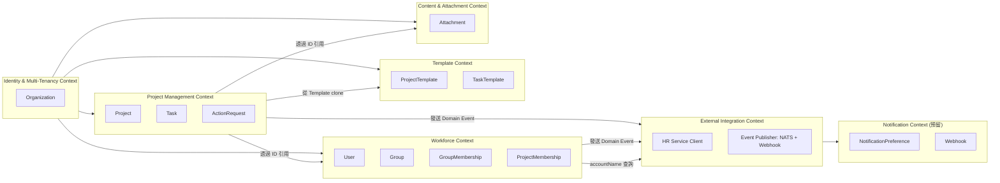
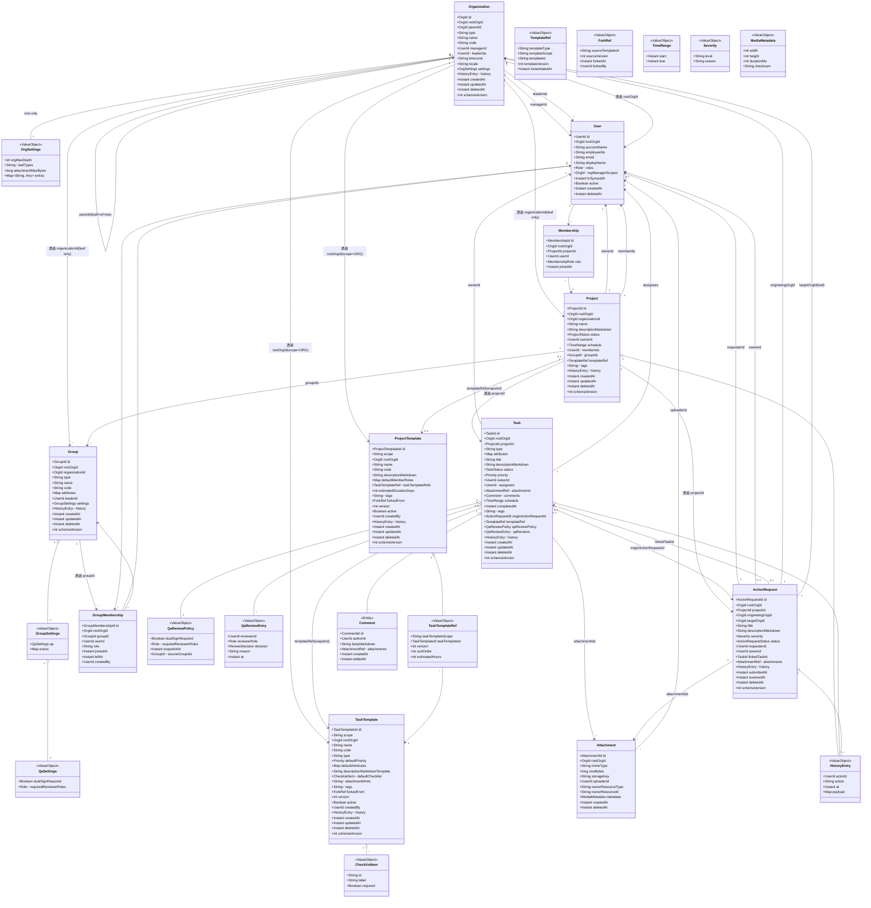
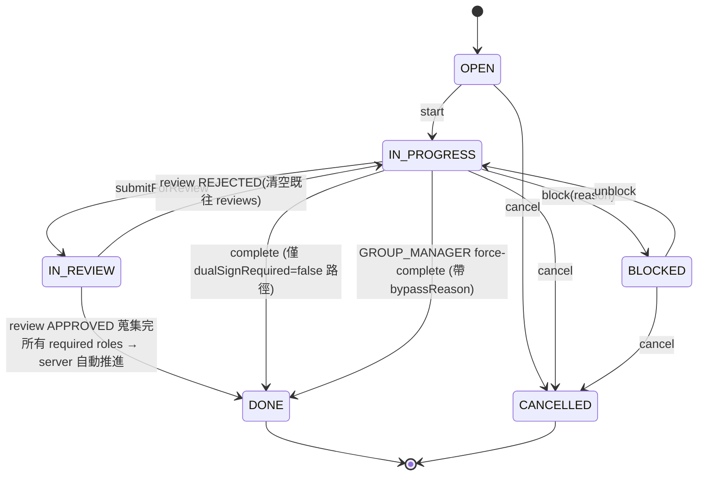
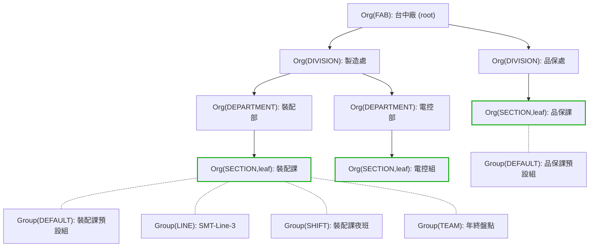
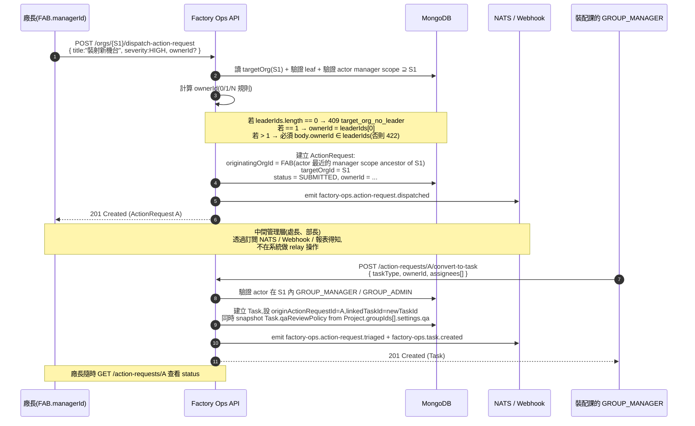
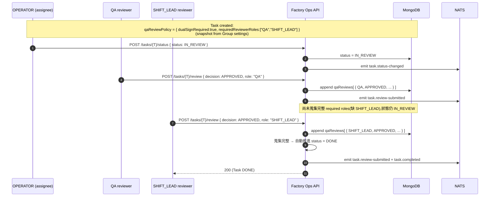
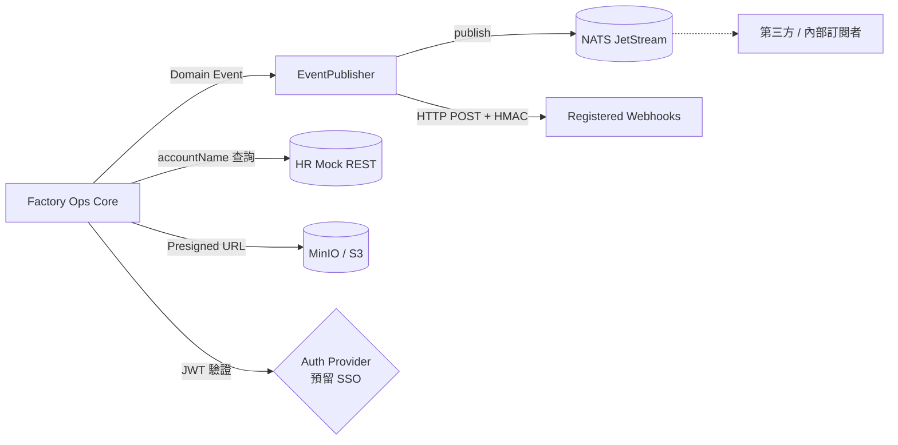

# 工廠值班工作管理系統 — 領域模型 (DDD)

**版本**: 1.3.0
**最後更新**: 2026-05-04
**負責 agent**: spec-architect

> **v1.3 變更摘要**(以 Q-1 ~ Q-17 全套拍板為基礎重整):
> - **Organization aggregate**:`leaderId`(單值)被取代為 `managerId`(單值,nullable)+ `leaderIds[]`(0..N);詳見 ADR-0010
> - **Group aggregate**:加 `settings: { qa: { dualSignRequired, requiredReviewerRoles[] } }`;詳見 ADR-0011
> - **Task aggregate**:加 `qaReviewPolicy`(snapshot at creation)+ `qaReviews[]`(append-only review log)
> - **ActionRequest aggregate**:刪除 `relayChain[]` 與 `RelayHop` VO;`assignedToOrgId` 改名 `targetOrgId` 且必為 leaf;狀態機刪除 `RELAYED` 子狀態
> - **User aggregate**:`orgManagerScopes[]` 改定位為**衍生 / cache 欄位**(權威來源是 Organization.managerId 反查);`roles[]` 不再直接含 `ORG_MANAGER`(衍生)
> - **時間**:儲存層仍 UTC `Instant`,API / 事件 wire format 為 ISO 8601 + offset(Q-17)
> - **跨 leaf 協作禁止**:Project `groupIds[]` 必須屬於 Project 自身的同一個 leaf Org(Q-13 拍板)
> - 新增 ADR-0010(單 manager + 多 leaders)、ADR-0011(Group QA 雙簽);ADR-0008 全面改寫(Single-hop direct dispatch)

---

## 1. Bounded Contexts



| Context | 主要職責 | Aggregates |
|---|---|---|
| **Identity & Multi-Tenancy** | Organization 樹、租戶隔離、單 manager + 多 leaders | `Organization`(含 tree topology) |
| **Workforce** | 使用者(HR 投影)、平面 Group、成員身份、Group settings (QA) | `User`、`Group`、`GroupMembership`、`Membership`(Project↔User) |
| **Project Management** | 專案、任務(含 QA review 流程)、動作需求(單跳跨層 dispatch) | `Project`、`Task`、`ActionRequest` |
| **Template** | Project / Task 範本(GLOBAL / ORG) | `ProjectTemplate`、`TaskTemplate` |
| **Content & Attachment** | 多媒體檔案 | `Attachment` |
| **External Integration** | HR 服務客戶端(Mock REST)、事件分發(NATS + Webhook) | (服務,非 aggregate) |
| **Notification(預留)** | 通知偏好、webhook 訂閱 | `NotificationPreference`、`Webhook` |

> Context 之間 **以 ID 引用而非直接 reference**(MongoDB 慣例);跨 context 的一致性以 **Domain Event** 達成最終一致(透過 NATS + Webhook 散播,見 ADR-0009)。所有資源(除 `Organization` 自身)必帶 `rootOrgId`,server 端強制 scope 隔離。

---

## 2. Aggregate 一覽

| Aggregate Root | 內含 Entity / VO | 是否獨立持久化 | 備註 |
|---|---|---|---|
| `Organization` | `OrgSettings`(VO,僅 root)、`HistoryEntry`(VO)、`leaderIds[]` | 是 | polymorphic by `type`,self-ref tree;v1.3 加 `managerId` + `leaderIds[]` |
| `User` | `RoleAssignment`(VO 列表)、`HistoryEntry` | 是 | HR 投影;`orgManagerScopes[]` 為衍生 cache |
| `Group` | `GroupSettings`(VO,含 qa)、`HistoryEntry` | 是 | 平面結構;polymorphic by `type`;屬唯一 leaf Org |
| `GroupMembership` | — | 是(獨立 collection) | User × Group 多對多 + 歷程 |
| `Membership`(ProjectMembership) | — | 是 | User × Project 多對多 |
| `Project` | `HistoryEntry`(VO 列表) | 是 | 屬唯一 leaf Org;`groupIds[]` 必屬同 leaf |
| `Task` | `Comment`、`HistoryEntry`、`AssignmentSnapshot`(VO)、`QaReviewPolicy`(VO snapshot)、`QaReviewEntry`(VO 列表) | 是 | v1.3 加 QA review snapshot + history |
| `ActionRequest` | `HistoryEntry`、`Severity`(VO) | 是 | v1.3 移除 relayChain;`targetOrgId` 必為 leaf |
| `ProjectTemplate` | `TaskTemplateRef`(VO 列表)、`HistoryEntry` | 是 | scope: GLOBAL / ORG |
| `TaskTemplate` | `ChecklistItem`(VO 列表)、`HistoryEntry` | 是 | scope: GLOBAL / ORG |
| `Attachment` | `MediaMetadata`(VO) | 是 | |
| `NotificationPreference` | — | 是 | |
| `Webhook` | — | 是 | |

---

## 3. 類別圖 (Class Diagram)



---

## 4. 關鍵 Aggregate 詳述

### 4.1 Organization(polymorphic 樹;v1.3:單 manager + 多 leaders)

| 欄位 | 型別 | 說明 |
|---|---|---|
| `id` | ObjectId | 聚合根 ID |
| `rootOrgId` | OrgId | 該節點所屬樹的 root;root 自己時 = `id` |
| `parentId` | OrgId? | nullable;root 為 null,其他必須與本節點同 `rootOrgId` |
| `type` | String | **多型 discriminator**:`FAB` / `DIVISION` / `DEPARTMENT` / `SECTION` / 自訂 |
| `name` | String(1-120) | 允許 Unicode 多語系混合 |
| `code` | String | 同 `rootOrgId` 內 unique |
| **`managerId`** | UserId? | **v1.3 新欄位**:該節點唯一經理(對應 ORG_MANAGER 角色);為跨層 ActionRequest dispatch 授權的權威來源 |
| **`leaderIds[]`** | List\<UserId\> | **v1.3 新欄位**:該節點業務負責人列表(0..N);ActionRequest 預設 ownerId 從中選 |
| `timezone` | String(IANA) | **僅 root 有效**,預設 `Asia/Taipei` |
| `locale` | String(BCP-47) | **僅 root 有效**,預設 `zh-TW` |
| `settings` | OrgSettings(VO) | **僅 root 有效**:`orgMaxDepth`、`leafTypes[]`、`attachmentMaxBytes` 等 |
| `history[]` | List<HistoryEntry> | append-only |
| `createdAt` / `updatedAt` / `deletedAt` | Instant | 儲存層 UTC;wire format ISO 8601 + offset |
| `schemaVersion` | int | |

**OrgSettings(僅 root)**:
```json
{
  "orgMaxDepth": 5,
  "leafTypes": ["SECTION"],
  "attachmentMaxBytes": 52428800,
  "extras": {}
}
```

**Type 範例(本期內建)**:`FAB` / `DIVISION` / `DEPARTMENT` / `SECTION`(預設 leaf type)。

**Invariants(對應 INV-12 / INV-13 / INV-26 / INV-30 / INV-32 / INV-33 / INV-34)**:
- `parentId` 鏈往上不可遇到自己(不成環)
- 從 root 到本節點的路徑長度 ≤ `root.settings.orgMaxDepth`
- `parentId` 必須與本節點同 `rootOrgId`
- `code` 在 `(rootOrgId)` 內 unique
- `managerId` 為單值(每節點最多一位 manager)
- `managerId` 與 `leaderIds[]` 中的 user 必須與 Organization 同 `rootOrgId` 且 `active = true`
- `User.orgManagerScopes[]` 為衍生 cache,寫入由 reactor 從 Organization 反查
- 軟刪除非 leaf 節點時必須先處理子孫;軟刪 root 等同 cascade
- 只有 `type ∈ root.settings.leafTypes` 的節點才能掛 Group / Project

**Domain Events**:
- `OrganizationCreated`(`factory-ops.org.created`)
- `OrganizationParentChanged`(`factory-ops.org.parent-changed`)
- `OrganizationManagerTransferred`(`factory-ops.org.manager-transferred`)— **取代** v1.2 leader-transferred
- `OrganizationLeaderAdded`(`factory-ops.org.leader-added`)
- `OrganizationLeaderRemoved`(`factory-ops.org.leader-removed`)
- `OrganizationSettingsUpdated`(`factory-ops.org.settings-updated`)
- `OrganizationArchived`(`factory-ops.org.archived`)

### 4.2 Group(平面 + polymorphic by `type` + settings.qa)

| 欄位 | 型別 | 說明 |
|---|---|---|
| `id` | ObjectId | |
| `rootOrgId` | OrgId | tenant 鍵 |
| `organizationId` | OrgId | 必填,**必須是 leaf Organization**(server 驗證) |
| `type` | String | **多型 discriminator**:`DEFAULT` / `LINE` / `TEAM` / `SHIFT` / 自訂 |
| `name` | String(1-120) | 允許 Unicode 多語系 |
| `code` | String | 同 `rootOrgId` 內 unique |
| `attributes` | Map<String, Any> | type-specific(寬鬆 schema) |
| `leaderId` | UserId? | Group 內組長(與 Organization.leaderIds 為不同概念) |
| **`settings`** | GroupSettings(VO) | **v1.3 新欄位**;含 `qa: { dualSignRequired, requiredReviewerRoles[] }` 與 `extras` |
| `history` | List<HistoryEntry> | append-only |
| `createdAt` / `updatedAt` / `deletedAt` | Instant | |
| `schemaVersion` | int | |

**GroupSettings 預設值**:
```json
{
  "qa": {
    "dualSignRequired": false,
    "requiredReviewerRoles": []
  },
  "extras": {}
}
```

**Type 範例 attributes**:
```json
// DEFAULT
{ }
// LINE
{ "productionLineCode": "SMT-L3", "capacityPerHour": 1200 }
// TEAM
{ "missionName": "年終盤點", "expectedEndAt": "2026-12-31T23:59:59+08:00" }
// SHIFT
{ "shiftCode": "NIGHT", "startLocalTime": "22:00", "endLocalTime": "06:00" }
```

**Invariants(對應 INV-14 / INV-15 / INV-16 / INV-22 / INV-23 / INV-35)**:
- `Group.organizationId` 對應的 Organization `type` 必須在 root settings.leafTypes 內
- `leaderId` 若非 null,該 user 必須有同 group 的 active GroupMembership
- 軟刪除前必須無 active GroupMembership 與進行中 Project / Task
- `code` 在同 `rootOrgId` 下 unique
- **不可有 parentId**(此欄位不存在)
- `settings.qa.dualSignRequired = true` 時 `requiredReviewerRoles[]` 不可為空
- `requiredReviewerRoles[]` 只接受第一線角色(`OPERATOR` / `SHIFT_LEAD` / `ENGINEER` / `QA` / `GROUP_ADMIN` / `GROUP_MANAGER`)

**Domain Events**:`GroupCreated`、`GroupUpdated`、`GroupDeleted`、`GroupLeaderTransferred`、`GroupMemberAdded`、`GroupMemberRemoved`、**`GroupSettingsQaUpdated`(新增,`factory-ops.group.settings-qa-updated`)**

### 4.3 GroupMembership(獨立 collection)

(同 v1.2,無變更)

### 4.4 ProjectTemplate(scope: GLOBAL / ORG)

(同 v1.2;**移除**多語系欄位設想 — Q-17 拍板取消)

### 4.5 TaskTemplate(scope: GLOBAL / ORG)

(同 v1.2)

### 4.6 Project(v1.3:groupIds 必屬同 leaf Org)

| 欄位 | 型別 | 說明 |
|---|---|---|
| `id` | ObjectId | |
| `rootOrgId` | OrgId | tenant 鍵 |
| `organizationId` | OrgId | **必為 leaf Org**(INV-21) |
| `name` | String(1-120) | 允許 Unicode 多語系 |
| `descriptionMarkdown` | String | |
| `status` | enum `ProjectStatus` | DRAFT / ACTIVE / PAUSED / COMPLETED / CANCELLED |
| `ownerId` | UserId | 必填 |
| `schedule` | TimeRange | `start` + `due` |
| `memberIds` | Set\<UserId\> | 含 owner |
| `groupIds` | Set\<GroupId\> | 至少 1 個;**每個必屬於 `Project.organizationId` 同一個 leaf Org**(INV-19,Q-13 拍板) |
| `tags` | List\<String\> | |
| `templateRef` | TemplateRef? | clone 來源的 snapshot |
| `history[]` | List\<HistoryEntry\> | |
| `createdAt` / `updatedAt` / `deletedAt` | Instant | |
| `schemaVersion` | int | |

**Invariants**:
- `ownerId ∈ memberIds`
- `schedule.due > schedule.start`(若兩者皆設)
- 狀態 `COMPLETED`/`CANCELLED` 後不允許新增 Task / ActionRequest
- `organizationId` 必為 leaf(INV-21)
- **`groupIds[]` 中每個 group 必須 `Group.organizationId == Project.organizationId`**(INV-19 v1.3 強化;Q-13)
- `groupIds[]` 中每個 group 必須與 Project 同 `rootOrgId` 且未軟刪

**Domain Events**:`ProjectCreated`、`ProjectStatusChanged`、`ProjectOwnerTransferred`、`ProjectArchived`、`ProjectGroupsUpdated`

### 4.7 Task(v1.3:加 QA review snapshot + history)

| 欄位 | 型別 | 說明 |
|---|---|---|
| ... | (同 v1.2) | |
| **`qaReviewPolicy`** | QaReviewPolicy(VO) | **v1.3 新欄位**;Task 建立時從 Project.groupIds[].settings.qa 合併 snapshot |
| **`qaReviews[]`** | List\<QaReviewEntry\> | **v1.3 新欄位**;append-only 簽核記錄 |

**QaReviewPolicy(VO,snapshot)**:
| 欄位 | 型別 | 說明 |
|---|---|---|
| `dualSignRequired` | Boolean | 由 OR(各 group.settings.qa.dualSignRequired) 計算 |
| `requiredReviewerRoles` | List<Role> | 由 ⋃(各 group.settings.qa.requiredReviewerRoles) 取聯集去重 |
| `snapshotAt` | Instant | snapshot 時間 |
| `sourceGroupIds` | List<GroupId> | 來源 Group ID,稽核用 |

**QaReviewEntry(VO)**:
| 欄位 | 型別 | 說明 |
|---|---|---|
| `reviewerId` | UserId | review 操作者 |
| `reviewerRole` | Role | 此次 review 套用的角色(必須在 policy 列示中) |
| `decision` | enum | `APPROVED` / `REJECTED` |
| `reason` | String? | 退回原因或備註 |
| `at` | Instant | |

**Invariants(對應 INV-1 ~ INV-3 / INV-5 / INV-6 / INV-8 / INV-9 / INV-11 / INV-31 / INV-36)**:
- (沿用 v1.1 / v1.2 invariants)
- `qaReviewPolicy` snapshot 後不可變;Group settings 後續變更不影響此 Task(INV-31)
- 若 `qaReviewPolicy.dualSignRequired = true`,`IN_PROGRESS → DONE` 直推被禁止;只能 `IN_REVIEW + review action 蒐集完成 → 自動 DONE`(INV-6 強化)
- `qaReviews[]` 中 `(reviewerId, role)` 對於同一 Task 必須 unique(INV-36;同 user 不可一次擔多角色簽核)

**Domain Events**:沿用 v1.2 + 新增:
- `factory-ops.task.review-submitted`
- `factory-ops.task.review-rejected`
- `factory-ops.task.completed`(原有,bypass force-complete 時 payload 帶 `bypassed: true`)

### 4.8 ActionRequest(v1.3:Single-hop direct dispatch;移除 relayChain)

| 欄位 | 型別 | 說明 |
|---|---|---|
| `id` | ObjectId | |
| `rootOrgId` | OrgId | |
| `projectId` | ProjectId? | 自課內提報時必填;**跨層 dispatch 起初為空,leaf triage 為 Task 時關聯 Project** |
| `originatingOrgId` | OrgId | 發起者所掛的 Org 節點(可任一層;actor 是該節點的 manager,且該節點是 targetOrg 的祖先;若自課內提報則 = targetOrgId) |
| **`targetOrgId`** | OrgId | **v1.3 改名(原 `assignedToOrgId`)**;**必為 leaf Org**(INV-24) |
| `title` | String | 允許 Unicode 多語系 |
| `descriptionMarkdown` | String | |
| `severity` | Severity (VO) | |
| `status` | enum | `SUBMITTED` / `TRIAGED` / `IN_PROGRESS` / `RESOLVED` / `REJECTED`(**v1.3 移除 RELAYED**) |
| `requesterId` | UserId | 提出者(自課內提報時為一般 user;跨層 dispatch 時為發起 manager 本人) |
| `ownerId` | UserId? | 預設 = `targetOrg.leaderIds`(0/1/N 規則,見 ADR-0010) |
| `linkedTaskId` | TaskId? | triage 後產生 |
| `attachments[]` | List\<AttachmentRef\> | |
| `history[]` | List\<HistoryEntry\> | |
| `submittedAt` / `resolvedAt` / `deletedAt` | Instant | |

**v1.3 移除欄位**:
- `assignedToOrgId`(改名為 `targetOrgId`)
- `relayChain[]`(刪除整個欄位)
- `RelayHop` VO(刪除)

**Invariants(對應 INV-24 / INV-25)**:
- `targetOrgId` 必須是 leaf Organization(`type ∈ root.settings.leafTypes`)
- `targetOrgId` 必須是 actor 某個 manager scope 節點(含相同節點)的子孫
- 跨層 dispatch 預設 `ownerId` 規則(0 → 409、1 → 自動、N → 派工方指定)

**狀態機**:見 §4.10。

### 4.9 User(HR 投影;v1.3:`orgManagerScopes` 為衍生 cache)

| 欄位 | 型別 | 說明 |
|---|---|---|
| `id` | ObjectId | |
| `rootOrgId` | OrgId | 必填 |
| `accountName` | String(VARCHAR(30)) | **HR 識別字**;`(rootOrgId, accountName)` unique |
| `employeeNo` | String | snapshot from HR |
| `email` | String? | snapshot from HR |
| `displayName` | String | snapshot from HR(允許 Unicode 多語系) |
| `roles[]` | List<Role> | 系統內角色(本系統管理);**v1.3 不再含 `ORG_MANAGER`**(衍生) |
| **`orgManagerScopes[]`** | List<OrgId> | **v1.3 改為衍生 / cache 欄位**;權威來源是 `Organization.managerId == userId` 反查;reactor 同步維護 |
| `hrSyncedAt` | Instant | 最近一次成功同步時間 |
| `active` | Boolean | HR 標記離職時 false |
| `createdAt` / `deletedAt` | Instant | |

**標註**:本 aggregate 為 **HR User 的本地投影**,profile 欄位以 HR 為權威;系統內專有資料(roles / orgManagerScopes / GroupMembership)由本系統管理。詳見 ADR-0007(含 v1.3 Mock REST Amendment)。

### 4.10 狀態機

#### Task(v1.3:依 qaReviewPolicy.dualSignRequired 分流)



> Q-21 待確認:reject 是否清空既往 reviews 仍在預設「清空」;若改保留,僅清掉特定 role review。

#### ActionRequest(v1.3:無 RELAYED)

```mermaid
stateDiagram-v2
    [*] --> SUBMITTED: 自課內提報 / 上級 manager direct dispatch (target=leaf)
    SUBMITTED --> TRIAGED: convert-to-task(leaf 端 GROUP_MANAGER / GROUP_ADMIN)
    SUBMITTED --> REJECTED: reject(reason)
    TRIAGED --> IN_PROGRESS: linkedTask 進入 IN_PROGRESS
    IN_PROGRESS --> RESOLVED: linkedTask DONE 或手動標記
    SUBMITTED --> RESOLVED: 直接處理(小事;手動)
    RESOLVED --> [*]
    REJECTED --> [*]
```



> 無 `RELAYED`(v1.3 刪除);無 `assignedToOrgId` 中途切換概念(targetOrgId 在 dispatch 寫入後不變)。

### 4.11 Organization 樹查詢 + Group 平面範例(v1.3:同節點 SHIFT Group)



> 綠框 = leaf;虛線 = Group 屬於 leaf Org。**「裝配課夜班」屬於裝配課**(同一 SECTION leaf),不跨 leaf;US-A5 Project 可同時掛 G1 + G3,皆屬 S1(Q-13 拍板)。

### 4.12 跨層派工 Sequence Diagram(v1.3:Single-hop)



### 4.13 QA 雙簽 Review Sequence(v1.3 新增,對應 ADR-0011)



---

## 5. Value Objects

| VO | 屬性 | 說明 |
|---|---|---|
| `OrgSettings` | `orgMaxDepth`、`leafTypes[]`、`attachmentMaxBytes`、`extras` | Organization root 設定 |
| `GroupSettings` | `qa: QaSettings`、`extras` | **v1.3 新增** |
| `QaSettings` | `dualSignRequired`、`requiredReviewerRoles[]` | **v1.3 新增** |
| `QaReviewPolicy` | `dualSignRequired`、`requiredReviewerRoles[]`、`snapshotAt`、`sourceGroupIds[]` | **v1.3 新增,Task 內 snapshot** |
| `QaReviewEntry` | `reviewerId`、`reviewerRole`、`decision`、`reason`、`at` | **v1.3 新增,Task 內 append-only** |
| `TimeRange` | `start`、`due` | due > start;UTC Instant 儲存,wire 用 ISO 8601 + offset |
| `HistoryEntry` | `actorId`、`action`、`at`、`payload` | 不可變、append-only |
| `Severity` | `level`、`reason` | level ∈ enum |
| `MediaMetadata` | `width`、`height`、`durationMs`、`checksum` | |
| `AttachmentRef` | `attachmentId`、`alt`、`role` | role ∈ {INLINE, ATTACHMENT, COVER} |
| `Priority` | enum | LOW / NORMAL / HIGH / URGENT |
| `Tag` | String | 限長 ≤ 32,kebab-case |
| `TemplateRef` | `templateType`、`templateScope`、`templateId`、`templateVersion`、`instantiatedAt` | |
| `TaskTemplateRef` | `taskTemplateScope`、`taskTemplateId`、`version`、`sortOrder`、`estimatedHours` | |
| `ChecklistItem` | `id`、`label`、`required` | |
| `ForkRef` | `sourceTemplateId`、`sourceVersion`、`forkedAt`、`forkedBy` | |

> **v1.3 移除**:`RelayHop`(隨 ActionRequest.relayChain[] 一併刪除)

---

## 6. Domain Events

> 統一 topic 命名:`factory-ops.<context>.<event-kebab>`(見 ADR-0009)。

| 事件 | 觸發點 | NATS Topic |
|---|---|---|
| `OrganizationCreated` | Org 節點建立 | `factory-ops.org.created` |
| `OrganizationParentChanged` | parentId 變更 | `factory-ops.org.parent-changed` |
| `OrganizationManagerTransferred` | managerId 變更(v1.3 取代 leader-transferred) | `factory-ops.org.manager-transferred` |
| `OrganizationLeaderAdded` | leader 加入 | `factory-ops.org.leader-added` |
| `OrganizationLeaderRemoved` | leader 移除 | `factory-ops.org.leader-removed` |
| `OrganizationSettingsUpdated` | root settings 變更 | `factory-ops.org.settings-updated` |
| `GroupCreated` | Group 建立 | `factory-ops.group.created` |
| `GroupSettingsQaUpdated`(v1.3 新) | settings.qa 變更 | `factory-ops.group.settings-qa-updated` |
| `GroupLeaderTransferred` | 組長變更 | `factory-ops.group.leader-transferred` |
| `GroupMemberAdded` | 成員加入 | `factory-ops.group.member-added` |
| `GroupMemberRemoved` | 成員離開 | `factory-ops.group.member-removed` |
| `UserHrSynced` | HR 同步成功 | `factory-ops.user.hr-synced` |
| `UserDeactivated` | HR 標離職 | `factory-ops.user.deactivated` |
| `ProjectTemplateVersionPublished` | Template 新版 | `factory-ops.project-template.version-published` |
| `ProjectTemplateForked` | Fork 自 GLOBAL | `factory-ops.project-template.forked` |
| `TaskTemplateVersionPublished` | Template 新版 | `factory-ops.task-template.version-published` |
| `TaskTemplateForked` | Fork 自 GLOBAL | `factory-ops.task-template.forked` |
| `ProjectCreated` | Project 建立 | `factory-ops.project.created` |
| `ProjectStatusChanged` | 狀態變更 | `factory-ops.project.status-changed` |
| `TaskCreated` | Task 建立 | `factory-ops.task.created` |
| `TaskAssigned` | 指派完成(初次或新增) | `factory-ops.task.assigned` |
| `OwnerTransferred` | 變更負責人 | `factory-ops.task.owner-transferred` |
| `TaskStatusChanged` | 狀態變更 | `factory-ops.task.status-changed` |
| `TaskReviewSubmitted`(v1.3 新) | review action(approve/reject) | `factory-ops.task.review-submitted` |
| `TaskReviewRejected`(v1.3 新) | review reject 觸發 | `factory-ops.task.review-rejected` |
| `TaskCompleted` | 進入 DONE(payload 含 `bypassed: bool`) | `factory-ops.task.completed` |
| `CommentAdded` | 新留言 | `factory-ops.task.comment-added` |
| `ActionRequestSubmitted` | 提交(自課內) | `factory-ops.action-request.submitted` |
| `ActionRequestDispatched` | 跨層 dispatch(originating manager 發起) | `factory-ops.action-request.dispatched` |
| `ActionRequestTriaged` | 轉成 Task | `factory-ops.action-request.triaged` |
| `ActionRequestRejected`(v1.3 新) | leaf 端 reject | `factory-ops.action-request.rejected` |
| `ActionRequestResolved` | 完成 | `factory-ops.action-request.resolved` |

> **v1.3 移除**:`ActionRequestRelayed`(對應 `factory-ops.action-request.relayed`)— 因為 relay 流程不存在了。

事件結構統一格式見 §FR-Notification.4(`occurredAt` 為 ISO 8601 + offset)。

---

## 7. 與外部服務的介面



MVP 階段:
- NATS:JetStream(持久化、at-least-once);docker-compose 起 NATS server
- Webhook:server 端 outbox + 重試 worker(指數退避,最多 5 次)
- HR:本地 Mock REST API(`MockHRClient` 實作);正式 adapter 替換時參照 ADR-0007 v1.3 Amendment 之 checklist
- ObjectStorage:docker-compose 起 MinIO

---

## 8. 多型策略統一摘要

| 項目 | Task | Group | Organization | Template |
|---|---|---|---|---|
| 多型 discriminator | `type` | `type` | `type` | `scope` |
| 自由屬性子文件 | `attributes`(JSON Schema 嚴格) | `attributes`(寬鬆) | (固定欄位) | (固定欄位) |
| 是否有 self-ref tree | 否 | **否(平面)** | **是**(`parentId`) | 否 |
| 內建值 | EQUIPMENT_INSPECTION / INCIDENT_RESPONSE / SHIFT_HANDOVER… | DEFAULT / LINE / TEAM / SHIFT | FAB / DIVISION / DEPARTMENT / SECTION | GLOBAL / ORG |
| 行為差異化 | `TaskTypePolicy` strategy + `qaReviewPolicy` snapshot | `settings.qa` | 由 root settings.leafTypes 決定能否承載工作 | scope 影響可見性與權限 |
| 新增值成本 | 加 Policy + JSON Schema | 加 enum 值 | 加 enum + 在 root settings 設定是否 leaf | scope 為固定二值,不可擴 |

---

## 9. 一致性策略

| 範圍 | 一致性 | 機制 |
|---|---|---|
| Aggregate 內部 | **強一致** | MongoDB 單文件 atomic update |
| Aggregate 間(同 context) | **最終一致** | Domain Event + 後續 reactor |
| 跨 Context | **最終一致** | NATS + Webhook |
| Task ↔ ActionRequest 雙向關聯 | **最終一致** | `TaskCompleted` 事件 reactor 回寫 ActionRequest |
| Organization 樹 invariant | **強一致** | 寫入時 server 計算深度與 cycle 檢查,失敗回 409 |
| Organization manager / leaders | **強一致** | aggregate root 內欄位 |
| `User.orgManagerScopes` cache | **最終一致** | Organization manager 變更後 reactor 更新 |
| Task QA review snapshot | **強一致(snapshot 那刻)** | Task 建立時計算合併 policy 並寫入 |
| Template 實例化 | **強一致(snapshot 那刻)** | clone 完成後即解耦 |
| 跨 root org 隔離 | **強一致** | 所有 query 強制帶 `rootOrgId`,repository 層 enforce |
| HR 同步 | **最終一致 + cached** | 登入時觸發 / 手動同步;HR 不可達時讀 cache |

---

## 10. 給下一棒(mongodb-modeler)的提示

### Collections
- `organizations`、`users`、`groups`、`group_memberships`、`memberships`(project membership)、`projects`、`tasks`、`action_requests`、`project_templates`、`task_templates`、`attachments`、`webhooks`、`webhook_dead_letters`、`outbox_entries`、`audit_logs`
- `Comment`、`HistoryEntry`、`QaReviewEntry`、`QaReviewPolicy` 內嵌於 `Task`(留言量在工廠場景預估 ≤ 50 / Task;review entries ≤ 5 / Task)。

### Embed vs Reference 取捨建議(v1.3)

**Embed**:
- `Organization.settings`(root only)、`Organization.history[]`、`Organization.leaderIds[]`(短陣列 0..N)
- `Group.settings.qa`、`Group.history[]`
- `Project.history[]`、`Task.history[]`、`Template.history[]`、`User.history[]`(若有)
- `Project.groupIds[]`(只是 ID 集合)
- `ProjectTemplate.taskTemplateRefs[]`
- `TaskTemplate.defaultChecklist[]`、`attachmentHints[]`、`tags[]`
- `Task.comments[]`(預估 ≤ 50)
- **`Task.qaReviewPolicy`(VO snapshot)**、**`Task.qaReviews[]`(VO 列表,預估 ≤ 5)** — v1.3 新
- ActionRequest 不再有 relayChain;其 attachments / history embed
- `User.orgManagerScopes[]`(衍生 cache,short array)

**Reference(獨立 collection)**:
- `GroupMembership`(獨立 — 成員多、保留歷史)
- `Membership`(同上)
- `Attachment`(獨立生命週期)
- `ProjectTemplate` / `TaskTemplate`(每 version 獨立 document,**GLOBAL 與 ORG 同一 collection 用 `scope` 欄位區分**)

### 關鍵設計問題給 mongodb-modeler
1. **Templates 同集合 + `scope` 欄位**(沿用 v1.2):唯一性 `(scope, rootOrgId, code, version)` partial unique
2. **Organization 樹查詢**:adjacency list(`parentId`)+ 額外 `path` 欄位(materialized)+ `isLeaf` derived 欄位
3. **User accountName 唯一鍵**:`(rootOrgId, accountName)` unique partial(`deletedAt: null`)
4. **`User.orgManagerScopes[]` 為 denormalized cache**:不建索引(由 reactor 維護);授權判定可即時從 `Organization.managerId` 反查作為防呆
5. **`Organization.managerId` 為單值 FK**:寫入時驗證 user `active` 與同 root
6. **`Organization.leaderIds[]` 為 array of FK**:multikey index 支援「user 是哪些節點 leader」反查
7. **`Task.qaReviewPolicy` 為 VO embed**:snapshot 不可變

### 索引候選(以 `rootOrgId` 開頭以利分區)

#### organizations
- `{ rootOrgId: 1, parentId: 1 }`(子節點列舉)
- `{ rootOrgId: 1, type: 1, deletedAt: 1 }`(leaf 過濾)
- `{ rootOrgId: 1, code: 1 }` unique partial
- `{ rootOrgId: 1, managerId: 1 }` sparse(反查「我是哪些節點 manager」)
- `{ rootOrgId: 1, leaderIds: 1 }` sparse multikey(反查「user 是哪些節點 leader」)
- `{ rootOrgId: 1, isLeaf: 1 }`(快速找 leaf)
- `{ rootOrgId: 1, path: 1 }` sparse(若採 materialized path)

#### groups
- `{ rootOrgId: 1, organizationId: 1, type: 1 }`(leaf 下列 Group)
- `{ rootOrgId: 1, code: 1 }` unique partial
- `{ rootOrgId: 1, leaderId: 1 }` sparse
- `{ rootOrgId: 1, "settings.qa.dualSignRequired": 1 }` sparse(找出有開雙簽的 Group)

#### group_memberships
- `{ rootOrgId: 1, groupId: 1, leftAt: 1 }`(active 成員)
- `{ rootOrgId: 1, userId: 1, leftAt: 1 }`(我屬於哪些 Group)
- `{ groupId: 1, userId: 1 }` unique partial

#### users
- `{ rootOrgId: 1, accountName: 1 }` unique partial
- `{ rootOrgId: 1, employeeNo: 1 }` unique sparse
- `{ rootOrgId: 1, active: 1 }`
- `{ hrSyncedAt: 1 }`(找出需要 re-sync 的 user)

#### projects
- `{ rootOrgId: 1, organizationId: 1, status: 1 }`
- `{ rootOrgId: 1, ownerId: 1, status: 1 }`
- `{ rootOrgId: 1, memberIds: 1 }`(multikey)
- `{ rootOrgId: 1, groupIds: 1 }`(multikey)
- `{ rootOrgId: 1, updatedAt: -1 }`

#### tasks
- `{ rootOrgId: 1, projectId: 1, status: 1, "schedule.due": 1 }`
- `{ rootOrgId: 1, ownerId: 1, status: 1 }`
- `{ rootOrgId: 1, assignees: 1, status: 1 }`(multikey)
- `{ rootOrgId: 1, type: 1, status: 1 }`
- `{ rootOrgId: 1, status: 1, "qaReviewPolicy.dualSignRequired": 1 }` sparse(Pending Review 看板)
- text:`title + descriptionMarkdown`

#### action_requests(v1.3)
- `{ rootOrgId: 1, originatingOrgId: 1, status: 1 }`(發起者查自派)
- `{ rootOrgId: 1, targetOrgId: 1, status: 1 }`(承接者查在我這的;**改名自 v1.2 assignedToOrgId**)
- `{ rootOrgId: 1, projectId: 1, status: 1 }` sparse
- `{ rootOrgId: 1, requesterId: 1 }`

#### project_templates / task_templates
- `{ scope: 1, rootOrgId: 1, code: 1, version: 1 }` unique partial
- `{ scope: 1, rootOrgId: 1, active: 1, updatedAt: -1 }`
- `{ scope: 1, tags: 1 }`(GLOBAL 與 ORG 都用 tag 篩選)
- `{ scope: 1, rootOrgId: 1, code: 1, active: 1, version: -1 }` partial(找最新 active)

### Schema 演進
- 全 collection 預留 `schemaVersion: int`(初版 = 1)、`createdAt`、`updatedAt`、`deletedAt`
- 軟刪除過濾在 repository 層統一處理
- `attributes` 為 free-form,但 server 用 JSON Schema 強制驗證,DB 不約束(Task 嚴格、Group 寬鬆)

### 跨租戶隔離
- 所有 repository query 必須帶 `rootOrgId`(從 JWT claims 取),禁止「裸 query」
- DB 索引第一個欄位都是 `rootOrgId`,有助於日後做 sharding by `rootOrgId`

### Organization 樹查詢
- adjacency list + 可選 materialized path
- 深度有上限(預設 5),`$graphLookup` 整棵子樹是可接受的
- `isLeaf` derived 欄位寫入時計算並存(由 type ∈ root.settings.leafTypes 推算)

### 時間欄位
- 儲存層:UTC `Instant`(BSON Date,毫秒精度)
- API / 事件 wire format:ISO 8601 + offset(`OffsetDateTime`,例 `2026-05-04T08:30:00+08:00`)
- 轉換點在 application service / DTO 層,domain layer 內部仍用 UTC
- Q-24 待確認是否需要在儲存層額外保留發起端原始 offset
