# Factory Ops 使用手冊(zh-TW)

**版本**:1.0(對應系統版本 1.0.0-M4)
**對象**:第一線值班人員、班長、組長、課長、部級以上主管
**最後更新**:2026-05-04

> 本手冊以 demo 用 dev 環境(`VITE_USE_MSW=true` 的 React 前端)截圖示範,真實 production 介面排版相同,僅資料內容差異。所有截圖位於 [`screenshots/`](./screenshots/),桌面版 1440×900、行動版 390×844。

---

## 目錄

1. [系統概觀](#1-系統概觀)
2. [登入](#2-登入)
3. [每日工作看板](#3-每日工作看板)
4. [專案管理](#4-專案管理)
5. [任務管理](#5-任務管理)
6. [動作需求(ActionRequest)](#6-動作需求actionrequest)
7. [跨層派工](#7-跨層派工)
8. [組織架構](#8-組織架構)
9. [群組管理](#9-群組管理)
10. [範本(Template)](#10-範本template)
11. [個人資料](#11-個人資料)
12. [行動裝置使用](#12-行動裝置使用)
13. [常見問題 FAQ](#13-常見問題-faq)

---

## 1. 系統概觀

Factory Ops 將工廠值班團隊的工作分為三類資料,**所有東西都隸屬於某個 Organization 樹**:

| 資料類型 | 用途 | 誰可建立 |
|---|---|---|
| **Project(專案)** | 一個有起訖時間的工作集合 | 班長/組長/課長 |
| **Task(任務)** | Project 下的具體工作項目 | 任何屬於該課的人(視 RBAC) |
| **ActionRequest(動作需求)** | 現場提出的「需要動作」需求,可轉成 Task | 任何登入使用者 |

**組織分為四層**:廠(FAB)→ 處(DIVISION)→ 部(DEPARTMENT)→ 課(SECTION)。**只有最底層的「課」實際做事**;上面三層只負責管理(Template、人員、跨層派工)。

每位使用者的權限由 **角色** + **所屬 Group** 決定,共有 9 種角色:`OPERATOR / SHIFT_LEAD / ENGINEER / QA / GROUP_ADMIN / GROUP_MANAGER / ORG_MANAGER / ORG_ADMIN / ADMIN`。詳見 [`docs/spec/requirements.md` §6 RBAC](../spec/requirements.md)。

---

## 2. 登入

開啟瀏覽器到系統首頁,會自動導到登入畫面。

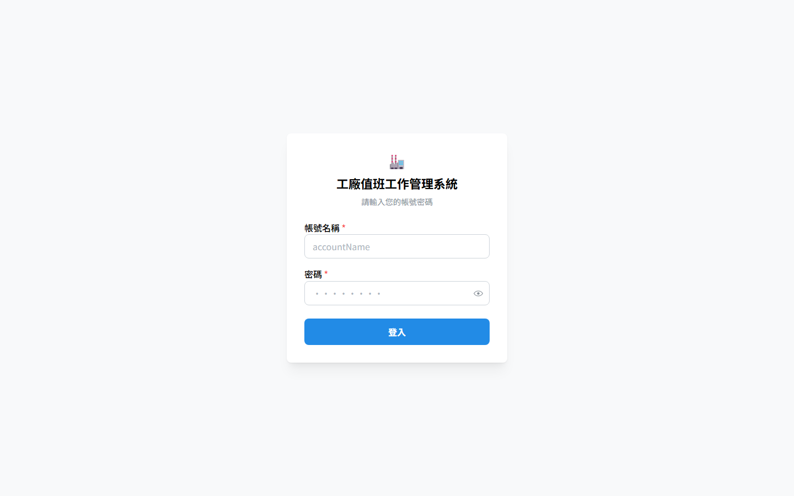

### 操作步驟

1. **帳號名稱**:輸入工號或公司帳號(如 `manager.wang`、`leader.chen`)
2. **密碼**:輸入個人密碼(初次登入由 ORG_ADMIN 提供臨時密碼)
3. 點 **登入** 按鈕

### Dev 環境預設帳號(僅 demo 用)

| 帳號 | 密碼 | 角色 |
|---|---|---|
| `admin.system` | `Admin@123456789` | ADMIN |
| `manager.wang` | `Manager@123456789` | ORG_ADMIN(廠長) |
| `leader.chen` | `Leader@123456789` | SHIFT_LEAD + GROUP_MANAGER |
| `operator.li` | `Operator@123456789` | OPERATOR |
| `qa.zhang` | `QA@1234567890` | QA + ENGINEER |

> **注意**:正式環境登入可能會額外要求「組織代碼(orgCode)」,以區分多個工廠租戶。

### 登入失敗

- 帳號或密碼錯誤 → 顯示「帳號或密碼錯誤」(統一訊息,不洩漏哪個錯誤)
- 連續錯誤超過上限 → 帳號鎖 15 分鐘(規劃中,本期 backlog)

---

## 3. 每日工作看板

登入後預設導到此頁,**整個系統的入口**。

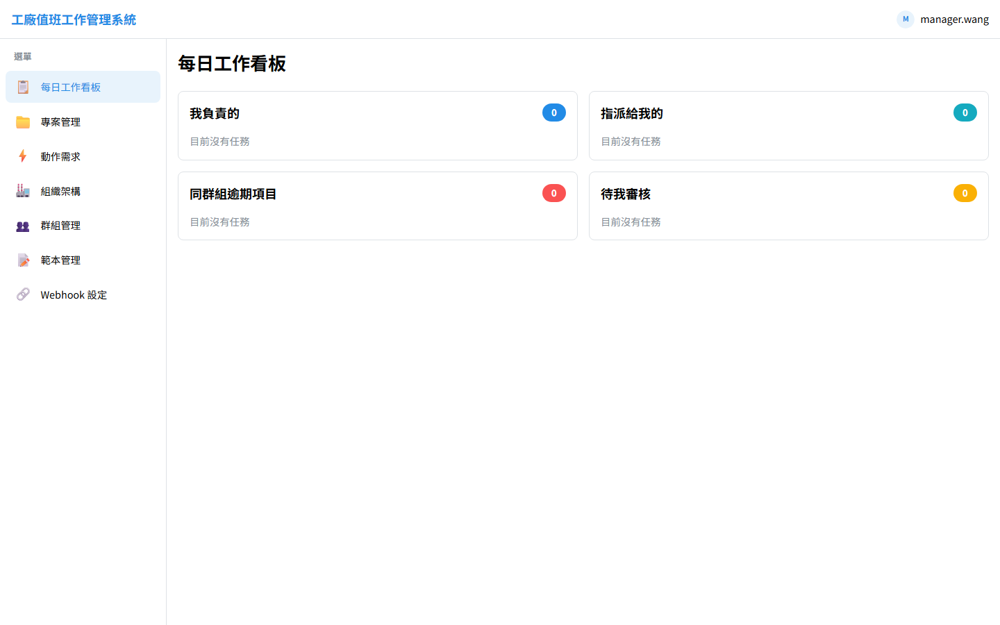

### 四個區塊

| 區塊 | 顯示內容 | 顏色 |
|---|---|---|
| **我負責的** | 我是 owner 的進行中 / 待處理任務 | 藍色徽章 |
| **指派給我的** | 我在 assignees 中但非 owner 的任務 | 藍色徽章 |
| **同群組逾期項目** | 同 Group 內已逾期的所有任務(壓力可見化) | 紅色徽章 |
| **待我審核** | 啟用 QA 雙簽且我具備 reviewer 角色的任務 | 黃色徽章 |

### 操作

- 點任一**卡片**直接進入該任務詳情頁
- 卡片數量為 0 時顯示「目前沒有任務」(常見:剛上班、上班沒分到事的情境)
- 數字徽章 = 該區塊現在有幾筆

### 左側選單

桌面版固定顯示,共 7 個入口:
- 每日工作看板
- 專案管理
- 動作需求
- 組織架構
- 群組管理
- 範本管理
- Webhook 設定(僅 ORG_ADMIN 可見)

---

## 4. 專案管理

### 4.1 專案列表

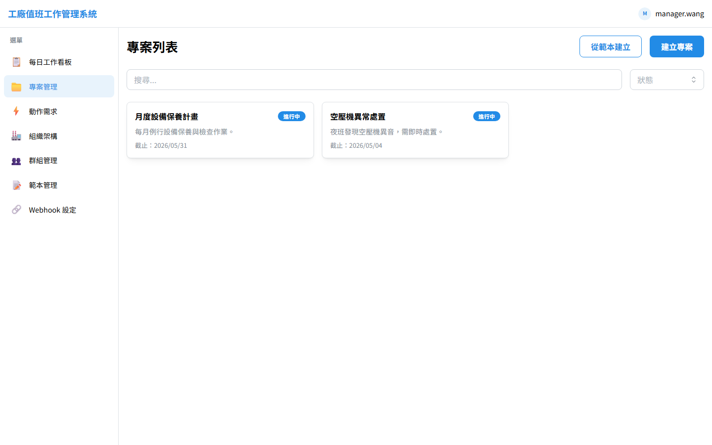

#### 主要元素
- **頂部過濾條**:狀態(草稿 / 進行中 / 暫停 / 完成 / 取消)、群組、關鍵字
- **+ 新建專案**:右上角按鈕(權限不足會隱藏)
- **從範本建立**:右上角次按鈕,可從 ProjectTemplate clone
- 每張卡片顯示:名稱、起訖時間、所屬 Group、狀態徽章、進度概要

#### 操作
- 點卡片 → 進入該專案詳情
- 滑到底自動載下一頁(cursor 分頁)

### 4.2 專案詳情

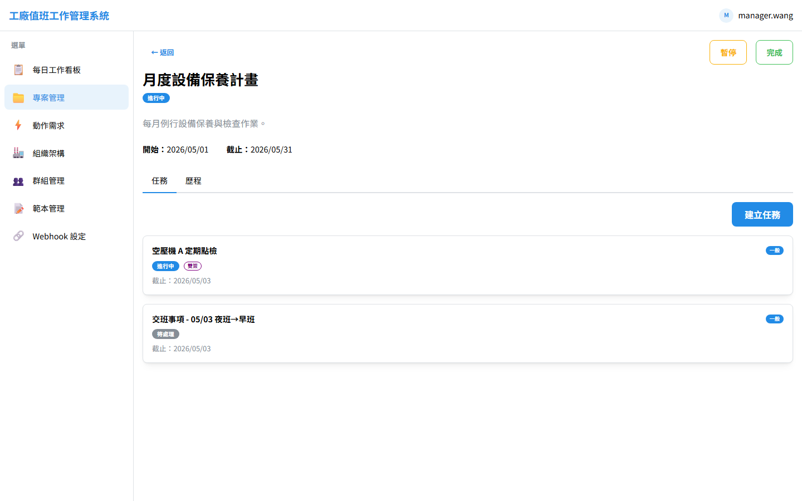

#### 分頁(Tab)
- **任務(Tasks)**:列出該專案下所有 Task,可按狀態 / 優先級 / 負責人過濾
- **動作需求(ActionRequests)**:列出綁到該專案的 AR
- **歷程(History)**:該專案的所有變更紀錄(誰、何時、改了什麼)

#### 重要按鈕
- **新增任務**:在當前專案下建立 Task(會繼承專案的 group 範圍)
- **變更狀態**:草稿 → 進行中 → 暫停/完成/取消(規則見 [INV-6](../spec/requirements.md))
- **轉移負責人**:獨立操作,會記錄理由與歷程

#### 約束
- 完成 / 取消狀態的專案**不能再加 Task**(INV-8)
- 專案 dueAt 必須晚於 startAt(INV-4)

---

## 5. 任務管理

任務是 Factory Ops 的核心工作單位。

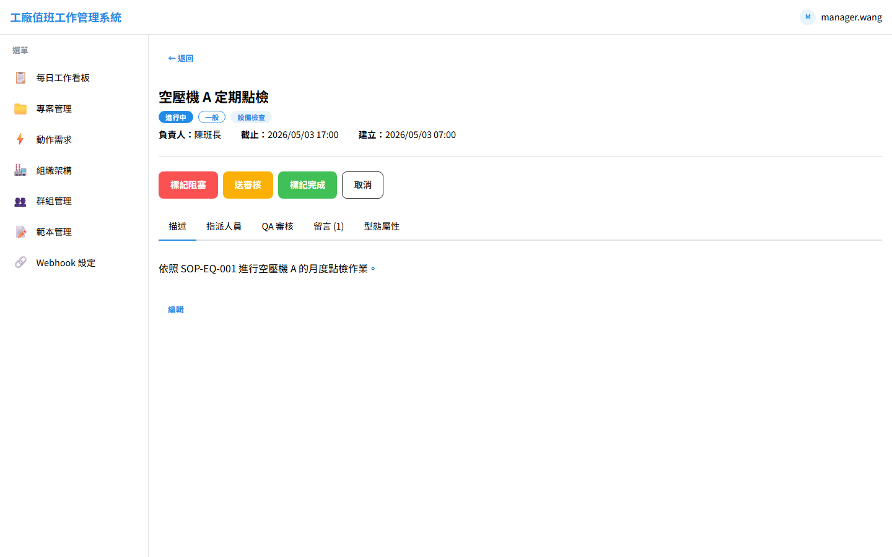

### 5.1 標題列

- **任務名稱**(例:空壓機 A 定期點檢)
- **狀態徽章**(進行中 / 阻塞 / 待審核 / 完成 / …)
- **優先級**(LOW / NORMAL / HIGH / URGENT,顏色對應)
- **型態**(EQUIPMENT_INSPECTION / INCIDENT_RESPONSE / SHIFT_HANDOVER / …)
- **負責人**、**截止時間**、**建立時間**

### 5.2 狀態流操作按鈕

依當前狀態顯示**合法的下一步**:

| 當前狀態 | 可進行的動作按鈕 |
|---|---|
| OPEN | 標記阻塞、開始進行 |
| IN_PROGRESS | 標記阻塞、送審核、標記完成、取消 |
| BLOCKED | 解除阻塞 |
| IN_REVIEW | 通過(reviewer 才可)、退回(reviewer 才可) |

> **QA 雙簽**:若所屬 Group 開啟 `dualSignRequired`,則 IN_REVIEW → DONE 必須由具備指定角色(如 QA)的 user 完成 review,**不能直推**。

### 5.3 分頁(Tab)

- **描述(Description)**:Markdown 內容,支援貼圖、附件、表格、程式碼塊。點 **編輯** 切編輯模式
- **指派人員(Assignees)**:加入/移除指派、轉移負責人
  - **重要規則**:`ownerId` 必須在 `assignees[]` 內(INV-1)
  - 移除 owner 自身 → 必須先 transferOwner 給別人
- **QA 審核**:若啟用雙簽,顯示已 review / 待 review 的角色清單;當前 user 具備角色時顯示 **Review** 按鈕
- **留言(Comments)**:Markdown 留言,可 `@accountName` 標記
- **型態屬性(Attributes)**:依 type 動態渲染(設備檢查 → 設備編號 / 點檢項目;異常處置 → 嚴重度 / 根因分類)

### 5.4 附件

- 上傳採**兩階段**:申請 presigned URL → 直接 PUT 到 MinIO(後端不轉發大檔)
- 在 Markdown 中以 `` 引用,前端自動解析渲染
- 單檔上限預設 50 MB(可由 ORG_ADMIN 在 Organization 設定調整)

---

## 6. 動作需求(ActionRequest)

ActionRequest 是「現場發現問題,但還沒決定誰來做」的需求收集機制。經過 **triage**(分流),由班長轉換為 Task。

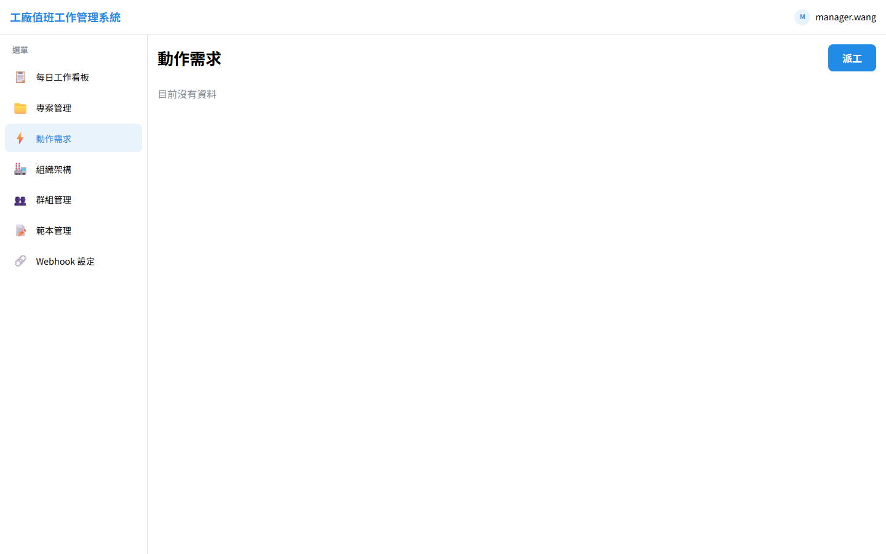

### 6.1 提交流程(任何登入使用者)

1. 進入「動作需求」頁,點 **新增**
2. 填寫:
   - 標題(短句,例「空壓機 A 異音」)
   - 描述(Markdown,可貼照片)
   - 嚴重度(LOW / NORMAL / HIGH / CRITICAL)
   - 影響的設備 / 區域(可選)
3. 送出 → 狀態 `SUBMITTED`

### 6.2 Triage(SHIFT_LEAD / GROUP_MANAGER 操作)

班長進「動作需求」頁查看 `SUBMITTED`,點開後可:
- **轉為任務(Convert to Task)**:選擇任務型態 → 自動建立 Task 並雙向關聯
- **拒絕(Reject)**:標 `REJECTED` 並寫理由

### 6.3 狀態流

```
SUBMITTED → TRIAGED → IN_PROGRESS → RESOLVED
                                  ↘ REJECTED
```

關聯的 Task 完成時,ActionRequest 自動標 `RESOLVED`(可手動覆蓋)。

---

## 7. 跨層派工

**僅 ORG_MANAGER 可見此功能**。上級單位的經理把 ActionRequest 直接派到下級的某個課(leaf SECTION),而不必逐層 relay。

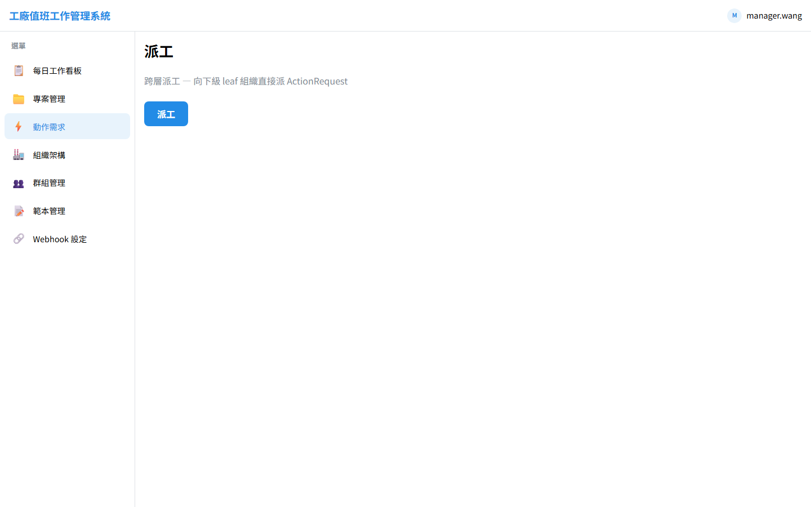

### 操作步驟

1. 點左側選單「動作需求」→ 右上角「跨層派工」
2. **選擇目標課(target leaf Org)**:從樹狀清單中挑選
   - 必須是發起者所屬節點的**子孫**(自動過濾)
   - 必須是 leaf 層(SECTION,自動過濾)
3. **預設負責人(Owner)規則**:
   - 該課**沒有 leader** → 警告無法派工(INV-25:`target_org_no_leader` 409)
   - 該課**只有 1 位 leader** → 自動選為 owner
   - 該課**有 N 位 leader** → 出現多選清單,**派工方必須指定**
4. 填寫標題、描述、嚴重度、截止時間
5. 送出 → 該課的 GROUP_MANAGER 會收到通知,後續 triage 為 Task

### 鏈路

```
廠長(FAB)→ 派 ActionRequest → 某課(SECTION,leaf)
                                ↓
                        該課 GROUP_MANAGER
                            triage 為 Task
                                ↓
                          指派給課內成員
```

### 為何不做「逐層 relay」

ADR-0008 經過 Q-14 釐清,採**單跳直派**模型,理由:
- 工廠實務:廠長/處長下令時,通常已知道哪個課負責,不需中間人
- 簡化追蹤:`originatingOrgId` + `targetOrgId` 兩欄就夠,無需 relayChain[]
- 速度:從 N 跳變 1 跳,延遲降低

---

## 8. 組織架構

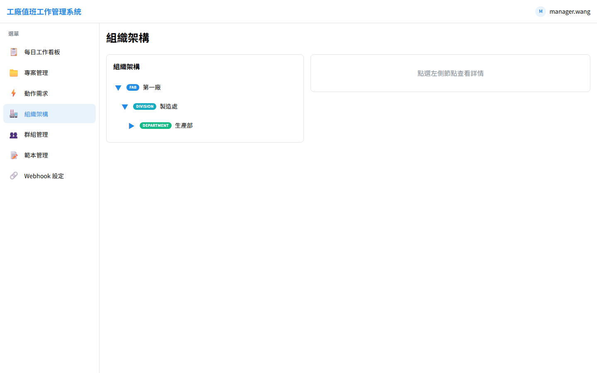

### 主要功能

- **左側樹狀檢視**:展開 / 摺疊各節點;節點旁顯示 type 徽章(`FAB` / `DIVISION` / `DEPARTMENT` / `SECTION`)
- **右側詳情面板**:點選節點後顯示
  - 節點屬性(name、code、type、parentId)
  - **Manager**(單一)+ **Leaders**(0..N)
  - 子節點清單
  - 該節點的所有 Group(僅 leaf)

### 角色分工

| 角色 | 對 Org 樹的權限 |
|---|---|
| ORG_ADMIN | 建立 / 修改 / 軟刪除節點;指派 manager / leaders |
| ORG_MANAGER | 唯一綁在某節點;可對其子孫派工 |
| 其他角色 | 唯讀 |

### 約束

- 移動節點時,**所有子孫的 ancestorIds[] 與 depth 自動 propagate**(ADR-0012)
- 不能成環(INV-12)
- 樹深度上限預設 5(由 root settings 調整)

---

## 9. 群組管理

### 9.1 群組列表

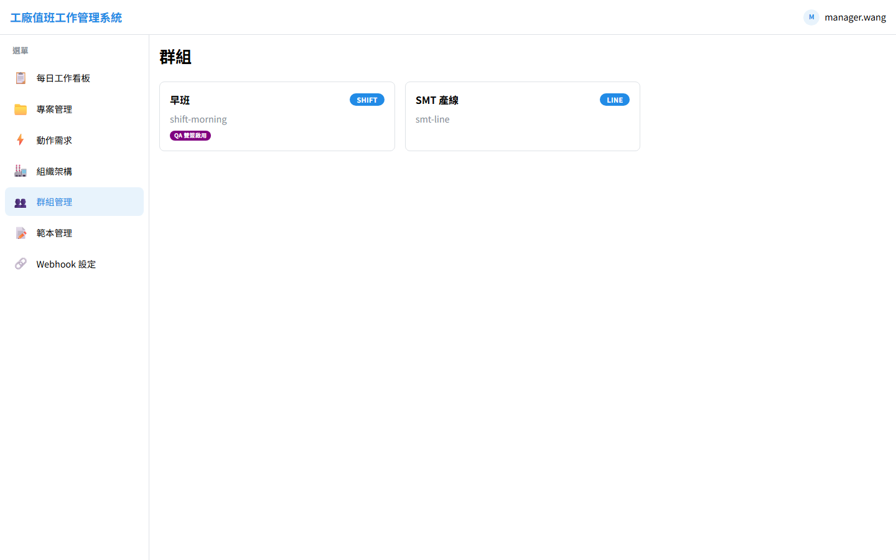

Group 是**平面結構**(無 parent / child),屬於唯一一個 leaf Org(課)。Group 之間的「組織關係」由所屬 Org 樹隱含表達。

#### 內建型態

- `DEFAULT`(課直屬,leaf Org 建立時自動產生一個)
- `LINE`(產線,例「SMT-Line-3」)
- `TEAM`(臨時編組 / 任務小組)
- `SHIFT`(班別,例「夜班」「假日班」)

> **新增 type 不需改 schema** — Group 採 polymorphic 設計(ADR-0004)。

### 9.2 群組詳情(含 QA 雙簽設定)

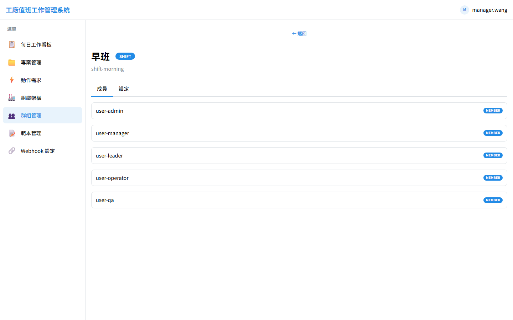

#### 分頁

- **成員(Members)**:加入 / 移除、轉移 leader
- **設定(Settings)**:**QA 雙簽開關 + reviewer 角色多選**
- **Project / Task 列表**:屬於本 Group 的工作

#### QA 雙簽設定(GROUP_MANAGER 操作)

```
[ ] 完成任務需要雙簽
    若勾選,reviewer 必須具備以下角色之一:
    [✓] QA   [ ] ENGINEER   [ ] SHIFT_LEAD   [ ] GROUP_ADMIN
```

> **重要**:QA settings 變更**只影響此後新建的 Task**(INV-31:Task 建立時 snapshot policy)。已存在的 Task 不受影響。
>
> reviewer roles 限第一線角色(INV-35),不接受 ADMIN / ORG_ADMIN。

---

## 10. 範本(Template)

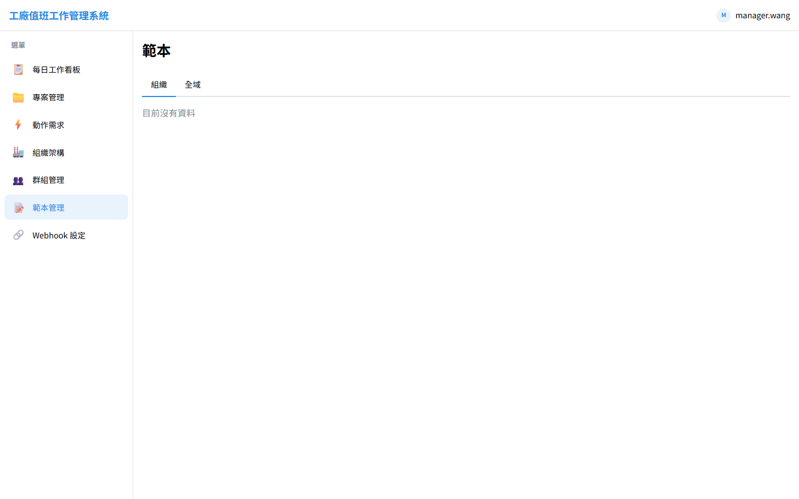

### 10.1 兩種 Scope

| Scope | 維護者 | 用途 |
|---|---|---|
| **GLOBAL**(全域) | ADMIN(SaaS 維運) | 跨組織通用範本(例「異常處置標準 SOP」)。Org 可直接實例化或 fork 為自己的 ORG scope |
| **ORG** | GROUP_ADMIN / GROUP_MANAGER / ORG_ADMIN | 該組織專屬,不跨 Org 共享 |

### 10.2 操作

- **頁籤切換**:GLOBAL / ORG(本組織)
- **Tag 過濾**:`safety` / `monthly` / `equipment` / `shift-handover` …
- **Fork(僅 GLOBAL → ORG)**:把全域範本複製成自家版本,後續演進與全域脫鉤
- **新建 / 編輯**:建立新版本(version++,append-only;舊版可繼續查詢但不能修改 — INV-17)
- **Deactivate**:停用後**不能再實例化**,但歷史紀錄保留

### 10.3 從範本建立 Project / Task

- 在「新建專案」對話框中選 `從範本建立 → 全域範本 / 我們組織的範本 → 選 tag → 選版本`
- 實例化是 **clone**(複製內容到新實例);實例化後雙方解耦(ADR-0006)
- 實例會記錄 `templateRef: { templateId, version, instantiatedAt }` 供稽核

---

## 11. 個人資料

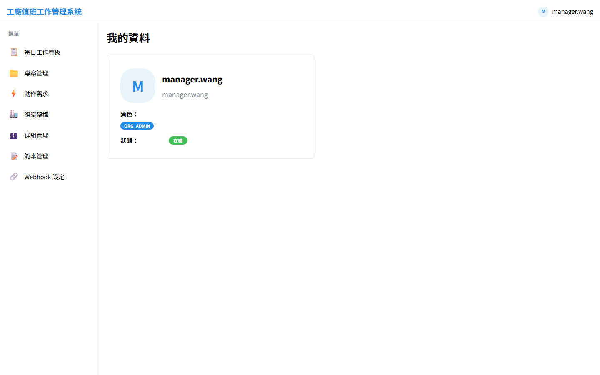

顯示當前登入使用者的基本資訊與系統設定。

### 顯示內容

- **基本資訊**(從 HR 同步):工號、顯示名稱、Email、所屬部門 / 課
- **系統內角色**:9 個角色中你具備哪些
- **所屬 Group**:當前 active 的 GroupMembership 清單
- **HR 同步狀態**:最近一次同步時間;HR 暫時不可達時會出現警示 banner
- **變更密碼**:`目前密碼` + `新密碼` + `確認新密碼`(舊 token 會被立即撤銷)

> 密碼最小長度 12 字元;規劃補上強度檢查(目前 backlog)。

---

## 12. 行動裝置使用

系統採 **mobile-first** 設計,所有觸控目標 ≥ 44 px,可戴手套操作。

| 桌面 | 行動裝置 |
|---|---|
|  | 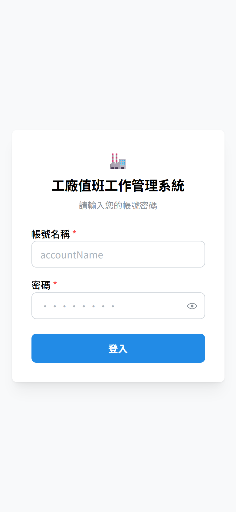 |
|  | 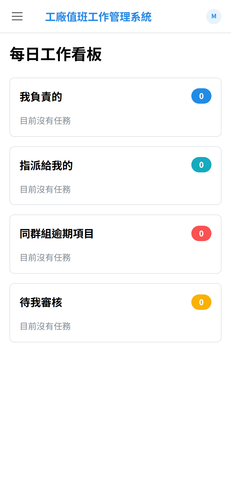 |
|  | 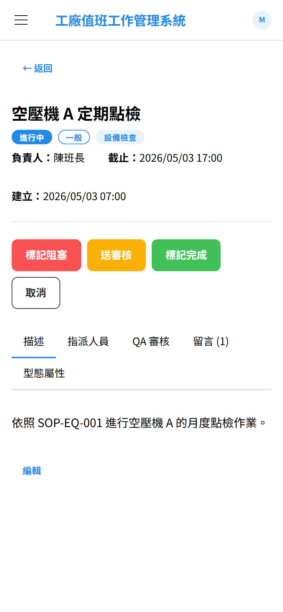 |
|  | 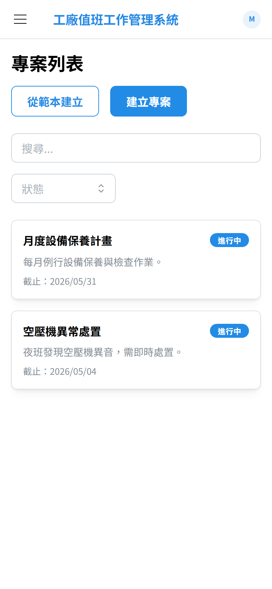 |

### 行動使用建議

- **戴手套輸入**:點按鈕區域大,但鍵盤輸入仍受限。建議用**貼圖**或**checklist** 簡短回應
- **訊號不穩**:列表頁支援 cursor 分頁,慢網路也能逐步載入(增量同步功能規劃中)
- **離線檢視最近 50 筆**:規劃中(spec FR-F1)
- **PDA 掃 QR 開設備對應任務**:規劃中(spec FR-F2)

---

## 13. 常見問題 FAQ

### Q1:為什麼我看不到「新建專案」按鈕?

只有 `SHIFT_LEAD / GROUP_ADMIN / GROUP_MANAGER / ORG_ADMIN` 角色可建專案。OPERATOR / ENGINEER / QA 看到的是唯讀。權限規則見 [`docs/spec/requirements.md` §6 RBAC](../spec/requirements.md)。

### Q2:任務從 IN_REVIEW 怎麼回到 IN_PROGRESS?

由 reviewer 點 **退回(Reject)**(QA 雙簽情境),會清空既有 reviews,Task 退回 IN_PROGRESS 等再修。

### Q3:我加錯了人到指派,怎麼移除?

任務詳情 → **指派人員** tab → 點該人員旁的 X。**注意**:若是 owner 本人,必須先 `transferOwner` 給別人才能移。

### Q4:為什麼 Group 改了 QA 雙簽設定後,正在進行的任務沒受影響?

**這是設計上故意的**(INV-31)。Task 建立時把當下的 `qaReviewPolicy` snapshot,後續 settings 變更只影響此後**新建**的 Task。避免「規則中途變更」造成已開始工作的混亂。

### Q5:跨層派工為什麼有時候會卡 owner_must_be_specified 422?

目標課有**多位 leaders**時(`leaderIds.length > 1`),系統不能自動選 owner,必須由派工方明確指定。在 dispatch 對話框中選擇即可。

### Q6:登入後一段時間沒動會被踢出?

Access token 有效 15 分鐘,expired 後前端會自動用 refresh token 換新(refresh token 有效 7 天)。連續 7 天沒動才會強制重登。Logout 會立即把 refresh token 列入黑名單。

### Q7:HR 顯示「同步失敗」怎麼辦?

HR 暫時不可達時:
- ✅ 既有使用者**仍可登入**(用本地 cached profile)
- ❌ **不能新建** User(因為無法驗證 accountName)
- ❌ **不能手動同步**(`POST /users/{id}/sync-from-hr`)

回復後系統會自動同步。

### Q8:ActionRequest 派錯了能撤回嗎?

可以,但目前流程是:
1. 派發者(ORG_MANAGER)在動作需求列表找到該 AR
2. 點 **拒絕(Reject)** + 說明理由
3. 接收的 GROUP_MANAGER 會看到狀態變更通知

### Q9:為何系統有時切到「全域 Template」沒看到任何資料?

GLOBAL 範本由 ADMIN(SaaS 維運)維護,初期可能尚未建立。請聯繫 IT 或在 ORG scope 自行建立。

### Q10:行動版的「我」按鈕在哪裡?

行動版頂部右側頭像 / 下拉選單 → 個人資料。底部有快捷導覽列(部分頁面)。

---

## 附錄 A:術語對照

| 中文 | 英文 | 說明 |
|---|---|---|
| 廠 | FAB | Organization root |
| 處 | DIVISION | Org 第二層 |
| 部 / 部門 | DEPARTMENT | Org 第三層 |
| 課 | SECTION | Org 第四層,**唯一可承載工作** |
| 群組 | Group | 平面工作單位,屬唯一一個課 |
| 專案 | Project | 有起訖時間的工作集合 |
| 任務 | Task | 具體工作項目,有 owner + assignees |
| 動作需求 | ActionRequest | 現場提出的需求,經 triage 後可轉成 Task |
| 派工 | Dispatch | 上級組織把 ActionRequest 派給下級的 leaf |
| 範本 | Template | Project / Task 的可重用樣板,有版本 |

## 附錄 B:重新產生本手冊截圖

```bash
cd frontend
npm run dev                          # 開另一個 terminal
npm run capture-screenshots          # 在這個 terminal 跑
```

完成後 `docs/user-manual/screenshots/` 會被覆蓋。詳細腳本見 [`frontend/scripts/capture-screenshots.ts`](../../frontend/scripts/capture-screenshots.ts)。

如果你想加新頁面或調整流程,編輯該腳本的 `desktopSteps` / `mobileSteps` 陣列即可。
